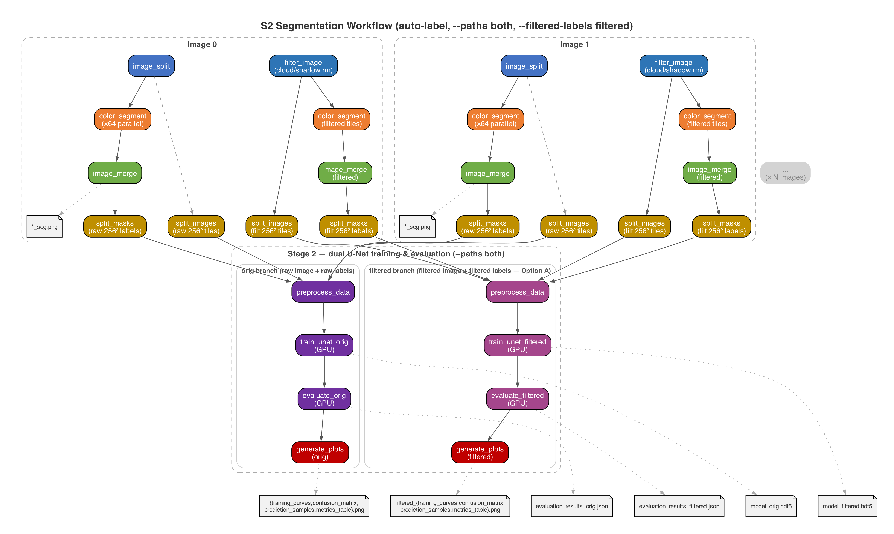

# S2 Segmentation Workflow

A [Pegasus WMS](https://pegasus.isi.edu/) workflow for **Sentinel-2 satellite sea ice segmentation**, executed on an [HTCondor](https://htcondor.org/) pool.

## Pipeline Overview

The workflow combines two stages into an end-to-end DAG. **The defaults reproduce the
reference paper's configuration exactly** — running with no optional flags is the canonical
paper reproduction (see [Reproducing the Paper](#reproducing-the-paper)).

**Stage 0 — Scene normalization**

0. **resize_image** — Resizes every input scene to 2048×2048 (the paper's scene geometry; 2048 divides evenly by 256, so no edge padding ever enters the labels). One job per scene. Disable with `--scene-size 0` to keep the native size (edge tiles are then padded — masks with the open-water value, so padding cannot become a phantom label class).

**Stage 1 — Color Segmentation (Label Generation)**

1. **image_split** — Splits each 2048×2048 scene into 64 tiles of 256×256. One job per source image, all run concurrently.
2. **color_segment** — HSV-based color segmentation on each tile (thin-ice/thick-ice/water classification, paper Fig 6). One job per tile — N×64 embarrassingly parallel HTCondor jobs.
3. **image_merge** — Reassembles 64 segmented tiles back into a full 2048×2048 mask. One merge per source image (fan-in).

**Auto-label Bridge (default; disable with `--no-auto-label`)**

3b. **split_images** — Splits each 2048×2048 scene into 256×256 grayscale training image tiles. Reuses `image_split` with `--grayscale --pad`. One job per source image.
3c. **split_masks** — Splits each 2048×2048 merged segmentation mask into 256×256 grayscale mask tiles (same grid as split_images). One job per source image. Together with split_images, these produce matched image/mask tile pairs for Stage 2.

**Stage 2 — U-Net Training & Evaluation (optional)**

4. **preprocess_data** — Loads 256×256 grayscale training images and masks (from auto-label tiles or `--train-images-dir`/`--train-masks-dir`), encodes labels, normalizes (L2, float32), performs 80/20 train/test split. Processes each split separately for memory efficiency. Outputs `.npy` arrays.
5. **train_unet** — Trains a 6-level U-Net (16→512 filters, 3-class softmax, categorical crossentropy, Adam optimizer). Supports single-GPU, multi-GPU (MirroredStrategy), and multi-node (Horovod) training modes.
6. **evaluate_model** — Evaluates the trained model on the test set. Outputs loss, accuracy, F1, precision, and recall.
7. **generate_plots** — Produces publication figures and tables: training curves, confusion matrix (Fig 13), prediction samples (Fig 14), metrics table (Table IV), and per-class metrics JSON.

```
  Image 0                    Image 1                    Image N-1
  ────────                   ────────                   ─────────
  image_split_0              image_split_1      ...     image_split_N-1
  ┌──┬──┬─...─┐              ┌──┬──┬─...─┐              ┌──┬──┬─...─┐
  seg seg seg seg            seg seg seg seg            seg seg seg seg
  (0) (1)(2) (63)            (0) (1)(2) (63)            (0) (1)(2) (63)
  └──┴──┴─...─┘              └──┴──┴─...─┘              └──┴──┴─...─┘
       │                          │                          │
  image_merge_0              image_merge_1             image_merge_N-1
       │                          │                          │
  [split_masks_0]           [split_masks_1]           [split_masks_N-1]
  (256x256 mask tiles)      (256x256 mask tiles)      (256x256 mask tiles)
       │                          │                          │
  [split_images_0]          [split_images_1]          [split_images_N-1]
  (256x256 img tiles)       (256x256 img tiles)       (256x256 img tiles)
       │                          │                          │
       └──────────────────────────┴──────────────────────────┘
                              │
                    (auto-label default: matched image + mask tiles)
                              │
                              ▼
                       preprocess_data
                              │
                              ▼
                         train_unet
                              │
                              ▼
                       evaluate_model
                              │
                              ▼
                       generate_plots
```



> **Note**: The `split_images_*` and `split_masks_*` jobs (shown in brackets) are part of the default auto-label mode. They produce matched training image/mask tile pairs directly from the source scenes. With `--no-auto-label`, Stage 2 reads pre-existing files from `--train-images-dir` and `--train-masks-dir`.

## Project Structure

```
s2-segmentation-workflow/
├── workflow_generator.py       # Pegasus DAG generator
├── bin/
│   ├── model.py                # Shared U-Net model definition
│   ├── resize_image.py         # Stage 0: scene normalization (2048×2048)
│   ├── image_split.py          # Stage 1: tile splitting
│   ├── color_segment.py        # Stage 1: HSV segmentation
│   ├── filter_image.py         # Thin-cloud/shadow removal (paper §III-A)
│   ├── image_merge.py          # Stage 1: tile reassembly (fan-in)
│   ├── compute_cloud_fraction.py  # Per-tile cloud/shadow fractions (Table V)
│   ├── preprocess_data.py      # Stage 2: data loading & encoding
│   ├── train_unet.py           # Stage 2: U-Net training (3 modes)
│   ├── evaluate_model.py       # Stage 2: model evaluation
│   ├── evaluate_stratified.py  # High/low-cloud stratified eval (Table V, Fig 13)
│   ├── infer_unet.py           # Whole-scene inference (Fig 9/14)
│   ├── generate_plots.py       # Stage 2: publication figures & tables
│   ├── confusion_matrices.py   # Analysis: row-normalized 3×3 confusion matrices (Fig 13)
│   └── recover_cloud_fractions.py  # Analysis: rebuild stratified inputs post-run
├── Docker/
│   └── S2_Dockerfile           # Container image definition
├── tests/                      # pytest test suite
│   ├── conftest.py             # Shared fixtures (synthetic data)
│   ├── test_image_split.py
│   ├── test_color_segment.py
│   ├── test_image_merge.py
│   ├── test_preprocess_data.py
│   ├── test_model.py
│   ├── test_train_unet.py
│   ├── test_evaluate_model.py
│   ├── test_workflow_generator.py
│   └── test_integration.py
├── download_data.py            # Sentinel-2 data download script (GEE)
├── run_manual.sh               # Bash-based local integration test
├── SPEC.md                     # Detailed workflow specification
├── requirements.txt            # Python dependencies
└── README.md
```

## Prerequisites

- Python 3.8+
- [Pegasus WMS](https://pegasus.isi.edu/) (for workflow generation and submission)
- [HTCondor](https://htcondor.org/) (execution backend)

```bash
pip install -r requirements.txt
```

For Horovod multi-node training (optional):

```bash
pip install horovod[tensorflow]
```

## Data

The workflow uses **Sentinel-2 optical imagery** from ESA's Copernicus program, collected via [Google Earth Engine](https://earthengine.google.com/). The reference dataset covers the **Antarctic Ross Sea** during the summer season (November 2019):

| Parameter | Value |
|---|---|
| Region | Ross Sea, Antarctica |
| Latitude | -70.00 to -78.00 (south) |
| Longitude | -140.00 to -180.00 (west) |
| Time period | November 2019 |
| Bands | B4 (red), B3 (green), B2 (blue) |
| Resolution | 10m per pixel |
| Scenes | 66 large scenes (2048×2048) |
| Training tiles | 4,224 images of 256×256 pixels |

> **Dataset-size note**: the paper's text says 66 scenes / 4,224 tiles, but the authors'
> reference training scripts load `train_images_4032/` — i.e. **63 scenes / 4,032 tiles**,
> matching the 63 scenes our GEE download yields (`s2_vis_56/57/64` are absent). The
> workflow reproduces the reference-code dataset. GEE exports come out 2000×2000; the
> workflow's default `--scene-size 2048` restores the paper's scene geometry in-DAG.

> Source: Iqrah et al., *"A Parallel Workflow for Polar Sea-Ice Classification using Auto-Labeling of Sentinel-2 Imagery,"* IEEE IPDPSW 2024. DOI: [10.1109/IPDPSW63119.2024.00172](https://doi.org/10.1109/IPDPSW63119.2024.00172)

### Downloading the Data

A download script is provided that uses the Google Earth Engine Python API:

```bash
# 1. Install the GEE API
pip install earthengine-api
pip install -r requirements.txt

# 2. Download and split into 256x256 training tiles
python download_data.py --method local --output-dir data/s2_scenes --split-tiles
    
python download_data.py --method local --output-dir data/s2_scenes --split-tiles --max-scenes 10

# Export to Google Drive (recommended for large downloads)
python download_data.py --project ee-yourproject \
    --method drive --drive-folder s2_ross_sea
```

After downloading, your data directory should look like:

```
data/
└── s2_scenes/          # Full 2000×2000 scene PNGs (workflow input)
    ├── s2_vis_00.png
    ├── s2_vis_01.png
    └── ...
```

> **Note**: With auto-labeling (the default), **no separate training data directories are needed**. The workflow produces everything within the DAG: scenes are resized to 2048×2048 (`resize_image`), `split_images` jobs tile each scene into 256×256 grayscale training images, and `split_masks` jobs tile the Stage 1 segmentation masks into matching 256×256 grayscale labels. Both use the same grid so image/mask counts always match, and 2048 divides evenly by 256 so no padding enters the labels. (With `--scene-size 0`, edge tiles are padded — masks with the open-water gray value 149, never zero — so padding cannot become a phantom label class; the zero-padding artifact that cost ~3.5 pt in pegasus2-run0001 is documented in `comparison_report.html` §8.1.) This is the auto-labeling approach described in the paper. If you have external ground-truth data, pass `--no-auto-label` with `--train-images-dir`/`--train-masks-dir`.

### Using Synthetic Test Data

For local testing **without real Sentinel-2 data**, the test suite and `run_manual.sh` generate synthetic images automatically:

```bash
# Bash-based integration test with synthetic data
bash run_manual.sh

# pytest suite with synthetic fixtures
pytest tests/ -v
```

## Usage

### 1. Build the Container Image

The workflow runs inside a Singularity/Docker container. Build and push the image before submitting:

```bash
docker build -t kthare10/s2-segmentation:latest -f Docker/S2_Dockerfile .
docker push kthare10/s2-segmentation:latest
```

### 2. Generate and Submit the Workflow

**Canonical paper reproduction — just the defaults:**

```bash
# The defaults do EVERYTHING the paper describes: resize scenes to
# 2048×2048, auto-label (Fig 6), train BOTH the unfiltered and the
# thin-cloud/shadow-filtered U-Net with self-consistent labels
# (Table IV), stratified high/low-cloud evaluation (Table V, Fig 13),
# and whole-scene inference (Fig 9/14).
python workflow_generator.py \
    --images data/s2_scenes/s2_vis_*.png \
    --output workflow.yml

pegasus-plan --submit -s condorpool -o local workflow.yml
```

**Quick test — 2 images (small DAG, same shape):**

```bash
python workflow_generator.py \
    --images data/s2_scenes/s2_vis_00.png data/s2_scenes/s2_vis_01.png \
    --output workflow.yml

pegasus-plan --submit -s condorpool -o local workflow.yml
```

**Variant scenarios (subsequent comparison runs — non-default flags):**

```bash
# Stage 1 color segmentation only (no training)
python workflow_generator.py --images data/s2_scenes/s2_vis_*.png \
    --no-auto-label --output workflow.yml

# Skip the optional paper outputs for a faster training-only run
python workflow_generator.py --images data/s2_scenes/s2_vis_*.png \
    --no-infer --no-stratified-eval --output workflow.yml

# Unfiltered branch only
python workflow_generator.py --images data/s2_scenes/s2_vis_*.png \
    --paths orig --output workflow.yml

# Honest cross-comparison: filtered inputs + raw-scene labels
# (yields ~90%, exposing that the paper's 98.97% requires
# label-consistency — see comparison_report.html §5)
python workflow_generator.py --images data/s2_scenes/s2_vis_*.png \
    --paths filtered --filtered-labels raw --output workflow.yml

# Per-tile filter variant (the Spark reference's inference path)
python workflow_generator.py --images data/s2_scenes/s2_vis_*.png \
    --filter-scale tile --output workflow.yml

# Native scene size (2000×2000, padded) instead of the paper's 2048
python workflow_generator.py --images data/s2_scenes/s2_vis_*.png \
    --scene-size 0 --output workflow.yml
```

See `comparison_report.md` for a side-by-side of every run mode against
the paper's reported numbers (U-Net-Auto: 90.18% original, 98.97% filtered).

**Horovod distributed training (multi-node GPU):**

```bash
# Horovod — uses multiple GPUs across nodes for training.
# Requires the container image built with Horovod support (see step 1).
python workflow_generator.py \
    --images data/s2_scenes/s2_vis_*.png \
    --training-mode horovod \
    --output workflow.yml

# With pre-existing masks + Horovod
python workflow_generator.py \
    --images data/s2_scenes/s2_vis_*.png \
    --no-auto-label \
    --train-images-dir data/train_images/ \
    --train-masks-dir data/train_masks/ \
    --training-mode horovod \
    --output workflow.yml

pegasus-plan --submit -s condorpool -o local workflow.yml
```

**Stage 1 only (no training):**

```bash
# Color segmentation only — produces one 2048×2048 merged mask per
# input image (e.g. s2_vis_00_seg.png; scenes are resized to 2048 by
# default — pass --scene-size 0 to keep native size). Does NOT produce
# 256×256 training tiles; the default auto-label mode does that.
python workflow_generator.py \
    --images data/s2_scenes/s2_vis_*.png \
    --output workflow.yml

pegasus-plan --submit -s condorpool -o local workflow.yml
```

**With pre-existing masks (no auto-label):**

```bash
# Use this only when you already have a directory of 256×256 mask
# tiles (e.g. from external ground-truth labels)
python workflow_generator.py \
    --images data/s2_scenes/s2_vis_*.png \
    --train-images-dir data/train_images/ \
    --train-masks-dir data/train_masks/ \
    --output workflow.yml
```

### 3. Workflow Generator Options

| Option | Default | Description |
|---|---|---|
| `--images` | (required) | Input Sentinel-2 PNG images |
| `--scene-size` | 2048 | Resize every scene to this square size in-DAG before any tiling (the paper's scene geometry; divides evenly by 256). `0` keeps the native size — edge tiles are then padded (masks with the open-water value 149). |
| `--tile-size` | 256 | Stage 1 color-segmentation tile size (paper's value; the legacy parallel demo used 250) |
| `--original-size` | 2000 | Native input scene dimension; only used with `--scene-size 0` |
| `--auto-label` | **on** | Single-DAG mode: splits source scenes + masks into matched 256×256 tiles for Stage 2 (no external dirs needed). `--no-auto-label` for Stage 1 only or external data dirs. |
| `--paths` | both | Which auto-label training path(s) to run: `both` (orig + thin-cloud/shadow-filtered, paper Table IV), `orig`, or `filtered`. With `both`, outputs are suffixed `_orig` / `_filtered`. |
| `--filtered-labels` | filtered | How the filtered branch's labels are produced. `filtered` color-segments the *filtered* tiles so input and target are self-consistent (reproduces the paper's ~99%). `raw` reuses raw-scene labels (filtered input vs raw target — the honest cross-comparison, ~90%). |
| `--infer` | **on** | After training, run `infer_unet` end-to-end on every scene (paper Fig 9): tile → optional filter → predict → merge → colour-coded prediction PNG. The filtered branch passes `--filter` so inference matches its training distribution. Outputs are named `{orig,filtered}_infer_<scene>.png`. `--no-infer` skips. |
| `--infer-images` | (same as `--images`) | Override the scenes used for inference — useful for predicting on fresh scenes that weren't part of the training corpus. |
| `--stratified-eval` | **on** | Compute per-tile cloud/shadow fractions (`compute_cloud_fraction` per scene), then evaluate each trained branch on the high-cloud (`≥10%`) and low-cloud (`<10%`) test subsets separately — reproducing paper Table V and the per-stratum panels of Fig 13. Emits per-branch `{branch}_{stratum}_confusion_matrix.png`, `{branch}_{stratum}_metrics_table.png`, `{branch}_evaluation_results_{stratum}.json`, and a `{branch}_stratified_summary.json` (e.g. `orig_high_cloud_confusion_matrix.png`). `--no-stratified-eval` skips. |
| `--cloud-threshold` | 0.10 | Cloud-fraction cutoff between strata (matches the paper's "≥10% / <10%" split). |
| `--filter-scale` | scene | Apply `only_shadow_cloud_removal` to the full scene (default, paper's described config) or per 256×256 training tile (`tile`, matches the Spark map-reduce inference path in the reference notebooks). |
| `--filter-kernel-size` | auto | `medianBlur` kernel for background estimation. Auto-defaults to **155** at `--filter-scale scene` (paper's value) and **19** at `--filter-scale tile` (scaled to keep the kernel the same fraction of the input dimension). Must be odd and ≥ 3. |
| `--train-images-dir` | None | Training images directory (use with `--no-auto-label`) |
| `--train-masks-dir` | None | Training masks directory (use with `--no-auto-label`) |
| `--training-mode` | single-gpu | Training mode: `single-gpu`, `mirrored`, or `horovod` |
| `--epochs` | 50 | Training epochs |
| `--batch-size` | 32 | Training batch size |
| `--n-classes` | 3 | Segmentation classes |
| `--container-image` | kthare10/s2-segmentation:latest | Docker container image |
| `--execution-site-name` | condorpool | CPU execution site |
| `--gpu-site-name` | gpu-condorpool | GPU execution site |

### Local Testing

Run the bash-based manual test (requires TensorFlow):

```bash
bash run_manual.sh
```

Run the pytest suite:

```bash
# All tests (skips TF/Pegasus tests if not installed)
pytest tests/ -v

# Fast tests only (Stage 1 — no TensorFlow required)
pytest tests/ -v -k "not train and not evaluate and not preprocess and not model and not workflow"

# Stage 2 tests (requires TensorFlow)
pytest tests/test_preprocess_data.py tests/test_model.py tests/test_train_unet.py tests/test_evaluate_model.py -v

# Workflow generator tests (requires Pegasus)
pytest tests/test_workflow_generator.py -v
```

## Outputs

With `--paths both` (default), Stage 2 artifacts are produced for **both** branches and
suffixed/prefixed as shown below. With `--paths orig` or `--paths filtered` alone, only
the corresponding suffix is emitted (no suffix when no auto-label is used).

| File | Description |
|---|---|
| `{basename}_seg.png` | Stage 1 merged segmentation mask (scene-sized, per source image) |
| `filtered_{basename}.png` | Thin-cloud/shadow-filtered source scene (when `--paths both` or `filtered`) |
| `model_orig.hdf5`, `model_filtered.hdf5` | Trained U-Net weights (one per branch) |
| `training_history_{orig,filtered}.json` | Loss/accuracy/F1 per epoch + training time |
| `evaluation_results_{orig,filtered}.json` | Test loss, accuracy, F1, precision, recall |
| `{orig,filtered}_training_curves.png` | Loss/accuracy/F1/precision-recall curves |
| `{orig,filtered}_confusion_matrix.png` | Normalized confusion matrix (paper Fig 13) |
| `{orig,filtered}_prediction_samples.png` | Side-by-side input/truth/prediction grid (paper Fig 14) |
| `{orig,filtered}_metrics_table.png` | Classification metrics table (paper Table IV) |
| `{orig,filtered}_per_class_metrics.json` | Per-class precision, recall, F1-score, support |

With a single unlabeled path (`--no-auto-label`), the same files are emitted without the
`orig_`/`filtered_` prefix (e.g. `confusion_matrix.png`).

## Reproducing the Paper

The paper (Iqrah et al., *"A Parallel Workflow for Polar Sea-Ice Classification using
Auto-labeling of Sentinel-2 Imagery,"* IEEE IPDPSW 2024) reports five distinct claims:

| Paper item | What it measures | Reproduced by |
|---|---|---|
| Table IV | U-Net-Auto accuracy on original vs filtered S2 imagery | Run **A** below |
| Table V | Same, stratified by ≥10% vs <10% cloud/shadow coverage | Run A (stratified eval, on by default) |
| Fig 13 | Confusion matrices per stratum (U-Net-Auto row) | Run A (stratified eval, on by default) |
| Fig 14 | Full-scene predictions on held-out scenes | Run A (inference, on by default) |
| Fig 12 | Distributed-training scaling over 1/2/4/(6)/8 GPUs | Run **C** below (sweep) |

**Run-to-run variance**: training is deliberately *not* seeded beyond the train/test split
(`random_state=0`), matching the reference scripts — weight initialization and dropout vary
between runs by ~1 pt. The paper's numbers are from a single run; repeat Run A a few times
and compare the spread before reading anything into sub-point differences.

Two methodological *variants* the paper does not separate cleanly are exposed as flags
so the difference can be measured:

- **Filter scale** (`--filter-scale {scene,tile}`) — the paper describes filtering whole
  2048×2048 scenes (Run A), but the reference Spark notebook implies a per-tile filter
  (Run **B** below). Compare the two.
- **Filtered-label derivation** (`--filtered-labels {filtered,raw}`) — `filtered` (default,
  Option A) re-derives labels from the filtered tiles to give input↔target consistency;
  `raw` keeps raw-scene labels. Filtered + raw labels yields ~90% — see
  `comparison_report.md` §5 for the why.

Gaps that are *not* yet covered are tracked in `gap_analysis.md` (most notably §2.1 SSIM,
§2.2 U-Net-Man manual-label baseline, and the Spark map-reduce auto-labeling speedup).

**Latest reproduction results** (pegasus2-run0002, 2026-06-13 — full Run A on a
distributed multi-site GPU pool, 14,317 jobs, paper-default config):

| Condition | Paper (U-Net-Auto) | Ours | Δ |
|---|:--:|:--:|:--:|
| Original S2 imagery | 90.18% | **96.25%** | +6.07 pt |
| Thin cloud / shadow filtered | 98.97% | **99.76%** | +0.79 pt |

Cloud-stratified (Table V): orig 94.32% high-cloud / 97.67% low-cloud; filtered
99.64% / 99.86%. The 2048 resize (default) eliminates the padding-class artifact that
capped the earlier run0001 at 91.21% orig. See `comparison_report.md` (figure-by-figure,
auto-generated) and `comparison_report.html` (long-form discussion) for details.

### Run A — paper Table IV + V + Fig 13 + Fig 14 (single submission)

Reproduces the paper's headline numbers and the stratified analysis. **This is the
canonical reproduction, and it is exactly the defaults** — 2048×2048 scenes, 256×256
tiles, scene-scale filter with kernel 155, Option A self-consistent labels, both
training branches, stratified evaluation, and whole-scene inference. No flags needed:

```bash
python workflow_generator.py \
    --images data/s2_scenes/s2_vis_*.png \
    --output workflow_A.yml

pegasus-plan --submit -s condorpool -o local workflow_A.yml
```

Produces (per branch — `orig` and `filtered`):
- `evaluation_results_{orig,filtered}.json` → Table IV cells
- `{orig,filtered}_evaluation_results_{high,low}_cloud.json` → Table V cells (U-Net-Auto)
- `{orig,filtered}_stratified_summary.json` → Table V row summary
- `{orig,filtered}_confusion_matrix.png` + `{orig,filtered}_{high,low}_cloud_confusion_matrix.png`
  → Fig 13 (U-Net-Auto row)
- `{orig,filtered}_infer_<scene>.png` (63 scenes × 2 branches) → Fig 14 (U-Net-Auto column)
- `filtered_s2_vis_*.png` → paper Fig 5 cleaned-scene grid

### Run B — §2.4 per-tile filter variant (optional comparison)

Same as Run A but applies `only_shadow_cloud_removal` to each 256×256 training tile
(matches the reference Spark inference path). `medianBlur` kernel auto-shrinks to 19 so
it stays the same fraction of the input dimension.

```bash
python workflow_generator.py \
    --images data/s2_scenes/s2_vis_*.png \
    --filter-scale tile \
    --output workflow_B.yml

pegasus-plan --submit -s condorpool -o local workflow_B.yml
```

Use Run B's filtered-branch numbers as a control for the "what if we filter per tile?"
counterfactual. Run B does **not** produce per-scene `filtered_s2_vis_*.png` — there is no
full-scene filter pass; only filtered training tiles exist.

**Result (pegasus2-run0003, 2026-06-15):** scene-scale filtering (Run A) beats per-tile
(Run B) by ~2.2 pt on both Table IV conditions — orig 96.25% (A) vs 94.02% (B), filtered
99.76% (A) vs 97.52% (B) — with the gap concentrated in thin-ice recall (the per-tile
filter lacks scene context). The paper's described scene-scale config is therefore both
canonical and better. The full claim-by-claim comparison of **both runs vs the paper** —
including the complete Fig 13 confusion matrices and a variance-vs-filter-scale analysis —
is consolidated in `comparison_report.md` §0 (and `comparison_report.html` §1A).

### Run C — paper Fig 12 distributed-training scaling sweep

Re-run the training step at several replica counts and aggregate. Submit each run with a
distinct `--output` filename so the output directories don't collide:

```bash
# 1 GPU baseline
python workflow_generator.py --images data/s2_scenes/s2_vis_*.png \
    --paths filtered --no-infer --no-stratified-eval \
    --training-mode single-gpu --output workflow_1gpu.yml
pegasus-plan --submit -s condorpool -o local workflow_1gpu.yml

# 2/4/8 GPUs on one node (MirroredStrategy)
for N in 2 4 8; do
    python workflow_generator.py --images data/s2_scenes/s2_vis_*.png \
        --paths filtered --no-infer --no-stratified-eval \
        --training-mode mirrored --output workflow_${N}gpu.yml
    # request_gpus = N is set in your HTCondor site profile.
    pegasus-plan --submit -s condorpool -o local workflow_${N}gpu.yml
done

# Optional: Horovod multi-node (replicas across hosts)
python workflow_generator.py --images data/s2_scenes/s2_vis_*.png \
    --paths filtered --no-infer --no-stratified-eval \
    --training-mode horovod --output workflow_horovod.yml
pegasus-plan --submit -s condorpool -o local workflow_horovod.yml
```

After all sweeps complete, aggregate the `training_history_filtered.json` files into the
Fig 12-style plot:

```bash
mkdir -p scaling
cp output_1gpu/training_history_filtered.json scaling/training_history_1gpu.json
cp output_2gpu/training_history_filtered.json scaling/training_history_2gpu.json
cp output_4gpu/training_history_filtered.json scaling/training_history_4gpu.json
cp output_8gpu/training_history_filtered.json scaling/training_history_8gpu.json

python bin/generate_speedup_plot.py --output-dir scaling \
    --title "U-Net training scaling — paper Fig 12 reproduction"
```

This writes `scaling/speedup_plot.png` (speedup vs ideal · samples/sec · total time ·
time-per-epoch — matching paper Fig 12) and `scaling/speedup_summary.csv`. Each
`training_history_*.json` now carries a `training_meta` block (mode / replicas /
batch_size / samples_per_epoch / epochs) plus `epoch_time_seconds` and
`samples_per_second` lists.

### Side-by-side comparison report

Once Run A finishes, regenerate the figure-by-figure paper comparison:

```bash
python compare_with_paper.py
```

This extracts Fig 3 / 4 / 5 / 11 / 13 / 14 / Table IV from the paper PDF, pairs them
with the matching run outputs from `output/`, and emits `comparison_report.md` with
side-by-side images and the headline-metric delta table.

### What this reproduces vs. what is still a gap

| Paper item | Covered? |
|---|---|
| Table IV (U-Net-Auto) | ✅ Run A |
| Table V (U-Net-Auto, 4 cells) | ✅ Run A `--stratified-eval` |
| Fig 13 (U-Net-Auto row) | ✅ Run A confusion matrices |
| Fig 14 (U-Net-Auto predictions) | ✅ Run A `--infer` (126 PNGs) |
| Fig 12 (distributed scaling) | ✅ Run C (multi-GPU sweep + aggregator) |
| Table IV/V/Fig 13/14 **U-Net-Man rows** | ❌ §2.2 — no manually-labeled training path yet |
| SSIM auto-label-vs-manual (89% / 99.64%) | ❌ §2.1 — not computed |
| Spark / Map-Reduce auto-labeling speedup (Table II, Fig 10) | ❌ §1.3 — HTCondor parallelism substitutes |

See `gap_analysis.md` for the full audit of paper / reference-code / workflow coverage.
