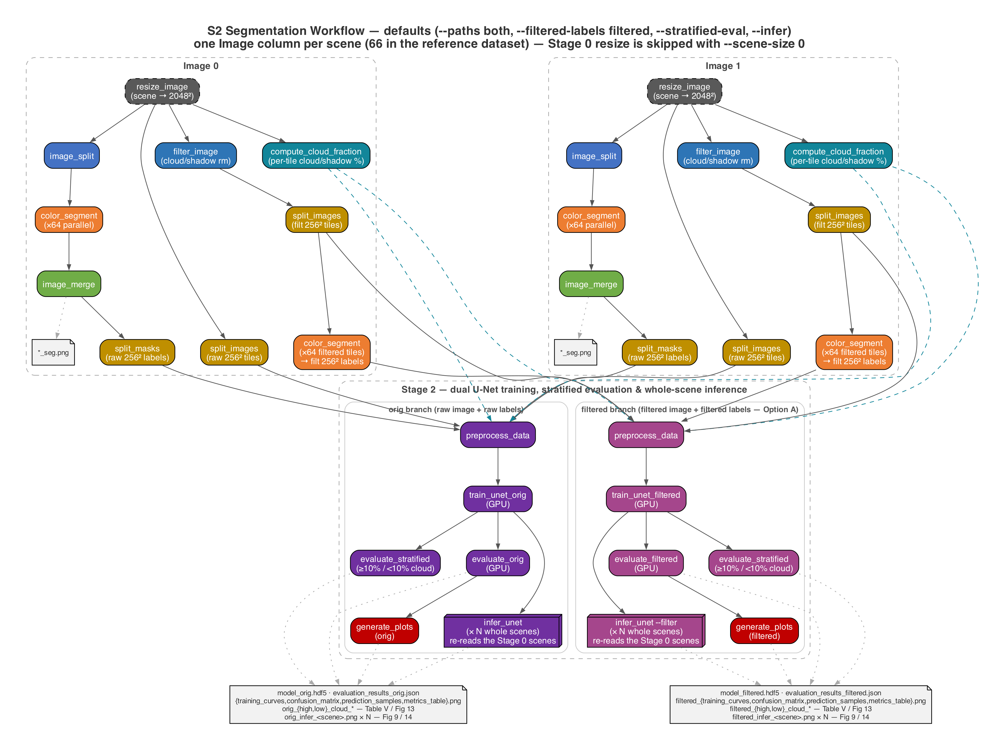

# S2 Segmentation Workflow

A [Pegasus WMS](https://pegasus.isi.edu/) workflow for **Sentinel-2 satellite sea ice segmentation**, executed on an [HTCondor](https://htcondor.org/) pool.

## Pipeline Overview

The workflow is a single end-to-end DAG in three stages. Stage 1 builds two parallel sets of
training tiles — one from the raw scenes (`orig`) and one from thin-cloud/shadow-filtered
scenes (`filtered`) — and Stage 2 trains, evaluates and runs inference for each. **The
defaults reproduce the reference paper's configuration exactly** — running with no optional
flags is the canonical paper reproduction (see [Reproducing the Paper](#reproducing-the-paper)).

**Stage 0 — Scene normalization**

0. **resize_image** — Resizes every input scene to 2048×2048 (the paper's scene geometry; 2048 divides evenly by 256, so no edge padding ever enters the labels). One job per scene. Disable with `--scene-size 0` to keep the native size (edge tiles are then padded — masks with the open-water value, so padding cannot become a phantom label class).

**Stage 1 — Color segmentation and auto-labeling**

One job set per scene; all scenes run concurrently.

*Color segmentation — always runs*

1. **image_split** — Splits each 2048×2048 scene into 64 tiles of 256×256. One job per source image.
2. **color_segment** — HSV-based color segmentation on each tile (thin-ice/thick-ice/water classification, paper Fig 6). One job per tile — N×64 embarrassingly parallel HTCondor jobs.
3. **image_merge** — Reassembles 64 segmented tiles back into a full 2048×2048 mask. One merge per source image (fan-in).

*Auto-label tile bridge — steps 4–8, on by default, all skipped with `--no-auto-label`*

Turns the segmentation into matched 256×256 U-Net training pairs. With `--no-auto-label`
none of steps 4–8 are emitted at all — including the entire filtered branch — and Stage 2
reads pre-existing tiles from `--train-images-dir` / `--train-masks-dir` instead. Pass
`--no-auto-label` with neither of those directories and the DAG stops after step 3:
color segmentation only, one merged mask per scene.

4. **split_masks** — Splits the merged mask from step 3 into 256×256 grayscale label tiles. Reuses `image_split` with `--grayscale --pad --pad-value 149` (the open-water gray, so padding cannot become a phantom 4th class).
5. **split_images** — Splits the *scene* — not the segmented tiles of step 1 — into matching 256×256 grayscale U-Net input tiles. Together with `split_masks` this gives Stage 2 matched image/label pairs for the `orig` branch.
6. **filter_image** — Starts the `filtered` branch (`--paths both|filtered`; `both` is the default): `only_shadow_cloud_removal` over the whole 2048×2048 scene (paper §III-A, `medianBlur` kernel 155). With `--filter-scale tile` it instead runs once per 256×256 tile, and the kernel auto-shrinks to 19.
7. **split_images (filtered)** — Tiles the cleaned scene into 256×256 U-Net inputs (`train_imgf_*`).
8. **color_segment (filtered)** — Color-segments each already-256×256 filtered tile, so it emits the filtered branch's **label** tiles directly — there is no second merge/re-split on this side. This is Option A (`--filtered-labels filtered`, the default): input and target are self-consistent. With `--filtered-labels raw` the branch reuses the `orig` labels from step 4 instead (the honest cross-comparison, ~90%).

*Stratification input — independent of the bridge (`--stratified-eval`, on by default)*

9. **compute_cloud_fraction** — Per-tile cloud/shadow fraction for each scene, read off the same Otsu mask `only_shadow_cloud_removal` computes internally, so "cloud/shadow" means exactly what the filter means by it. One job per scene, emitted whether or not auto-labeling is on; the JSONs ride through `preprocess_data` aligned with `X_test` and drive Table V / Fig 13.

**Stage 2 — U-Net training, evaluation & inference (once per branch)**

10. **preprocess_data** — Loads 256×256 grayscale training images and masks (from auto-label tiles or `--train-images-dir`/`--train-masks-dir`), encodes labels, normalizes (L2, float32), performs an 80/20 train/test split. Processes each split separately for memory efficiency. Outputs `.npy` arrays, plus `test_cloud_fractions.npy` when stratified evaluation is on.
11. **train_unet** — Trains a 6-level U-Net (16→512 filters, 3-class softmax, categorical crossentropy, Adam optimizer). Supports single-GPU, multi-GPU (MirroredStrategy), and multi-node (Horovod) training modes.
12. **evaluate_model** — Evaluates the trained model on the full test set. Outputs loss, accuracy, F1, precision, and recall (paper Table IV).
13. **evaluate_stratified** — Splits the test set at `--cloud-threshold` (default `0.10`) into ≥10% and <10% cloud/shadow strata and evaluates each: confusion matrices, metrics tables, per-class JSON and a `stratified_summary.json` (paper Table V, Fig 13). Disable with `--no-stratified-eval`.
14. **generate_plots** — Produces publication figures and tables: training curves, confusion matrix (Fig 13), prediction samples (Fig 14), metrics table (Table IV), and per-class metrics JSON.
15. **infer_unet** — Applies the freshly trained model to whole scenes: tile, classify, merge back into one per-scene sea-ice map (paper Fig 9 / 14). One job per (branch, scene); filtered-branch jobs re-apply `only_shadow_cloud_removal` first so the model sees the distribution it was trained on. Disable with `--no-infer`; choose scenes with `--infer-images`.

```
  ─── Stage 0 + 1 — one job set per scene i, all N scenes concurrent ──────────

                               resize_image_i
            ┌───────────────┬────────┴───────┬────────────────┐
            ▼               ▼                ▼                ▼
      image_split_i   split_images_i   filter_image_i   compute_cloud_
      ┌──┬──┬─...─┐   (raw 256² imgs)        │           fraction_i
      seg seg ... seg                        ▼                 │
      (0)(1)    (63)                  split_images_i           │
      └──┴──┴─...─┘                   (filt 256² imgs)         │
            │                                │                 │
            ▼                                ▼                 │
      image_merge_i                   color_segment ×64        │
      (2048² mask)                    (per filtered tile)      │
            │                                │                 │
            ▼                                ▼                 │
      split_masks_i                   filt 256² labels         │
      (raw 256² labels)                      │                 │
            │                                │                 │
  ──────────┴────────────────────────────────┴─────────────────┴─────────────
       raw imgs + raw labels          filt imgs + filt labels   cloud % → both
            │                                │
            ▼                                ▼

  ─── Stage 2 — both branches from one submission ────────────────────────────

       orig branch                          filtered branch
            │                                      │
      preprocess_data                        preprocess_data
            │                                      │
      train_unet_orig                        train_unet_filtered
       ┌────┴────┬──────────┐                 ┌────┴────┬──────────┐
       ▼         ▼          ▼                 ▼         ▼          ▼
  evaluate_  evaluate_   infer_unet      evaluate_  evaluate_   infer_unet
  model      stratified  (× N scenes)    model      stratified  --filter
       │     (Table V,   (Fig 9/14)           │     (Table V,   (× N scenes)
       ▼      Fig 13)                         ▼      Fig 13)
  generate_plots                         generate_plots
  (Fig 13/14, Table IV)                  (Fig 13/14, Table IV)
```



> **Note**: `resize_image` is skipped with `--scene-size 0` (use it when the scenes are
> already 2048×2048, as the authors' are). Color segmentation — `image_split`,
> `color_segment`, `image_merge` — always runs; it is the tile bridge below it (steps 4–8,
> the whole `orig` and `filtered` training-pair chain) that `--no-auto-label` removes, and
> Stage 2 then reads tiles from `--train-images-dir` / `--train-masks-dir`. The filtered
> column alone disappears with `--paths orig`, and `compute_cloud_fraction` /
> `evaluate_stratified` with `--no-stratified-eval`.
>
> The figure above is generated by `generate_workflow_diagram.py` and was last checked on
> 2026-09-21 against the planned DAG of run0004 (`pegasus-graphviz workflow.yml`). Re-run it
> after adding or removing a job type.

## Project Structure

```
s2-segmentation-workflow/
├── workflow_generator.py       # Pegasus DAG generator
├── bin/
│   ├── model.py                # Shared U-Net model definition
│   ├── resize_image.py         # Stage 0: scene normalization (2048×2048)
│   ├── image_split.py          # Stage 1: tile splitting
│   ├── color_segment.py        # Stage 1: HSV segmentation
│   ├── filter_image.py         # Thin-cloud/shadow removal (paper §III-A)
│   ├── image_merge.py          # Stage 1: tile reassembly (fan-in)
│   ├── compute_cloud_fraction.py  # Per-tile cloud/shadow fractions (Table V)
│   ├── preprocess_data.py      # Stage 2: data loading & encoding
│   ├── train_unet.py           # Stage 2: U-Net training (3 modes)
│   ├── evaluate_model.py       # Stage 2: model evaluation
│   ├── evaluate_stratified.py  # High/low-cloud stratified eval (Table V, Fig 13)
│   ├── infer_unet.py           # Whole-scene inference (Fig 9/14)
│   ├── generate_plots.py       # Stage 2: publication figures & tables
│   ├── confusion_matrices.py   # Analysis: row-normalized 3×3 confusion matrices (Fig 13)
│   └── recover_cloud_fractions.py  # Analysis: rebuild stratified inputs post-run
├── Docker/
│   └── S2_Dockerfile           # Container image definition
├── tests/                      # pytest test suite
│   ├── conftest.py             # Shared fixtures (synthetic data)
│   ├── test_image_split.py
│   ├── test_color_segment.py
│   ├── test_image_merge.py
│   ├── test_preprocess_data.py
│   ├── test_model.py
│   ├── test_train_unet.py
│   ├── test_evaluate_model.py
│   ├── test_workflow_generator.py
│   └── test_integration.py
├── download_data.py            # Sentinel-2 data download script (GEE)
├── run_manual.sh               # Bash-based local integration test
├── SPEC.md                     # Detailed workflow specification
├── requirements.txt            # Python dependencies
└── README.md
```

## Prerequisites

- Python 3.8+
- [Pegasus WMS](https://pegasus.isi.edu/) (for workflow generation and submission)
- [HTCondor](https://htcondor.org/) (execution backend)

```bash
pip install -r requirements.txt
```

For Horovod multi-node training (optional):

```bash
pip install horovod[tensorflow]
```

## Data

The workflow uses **Sentinel-2 optical imagery** from ESA's Copernicus program, collected via [Google Earth Engine](https://earthengine.google.com/). The reference dataset covers the **Antarctic Ross Sea** during the summer season (November 2019):

| Parameter | Value |
|---|---|
| Region | Ross Sea, Antarctica |
| Latitude | -70.00 to -78.00 (south) |
| Longitude | -140.00 to -180.00 (west) |
| Time period | November 2019 |
| Bands | B4 (red), B3 (green), B2 (blue) |
| Resolution | 10m per pixel |
| Scenes | 66 large scenes (2048×2048) |
| Training tiles | 4,224 images of 256×256 pixels |

> **Dataset provenance**: the authors supplied the source data directly — 66 scenes
> as `s2_vis_00..65.png`, natively **2048×2048** (they divide evenly by 256, giving the
> paper's 66 × 64 = **4,224** tiles). The workflow reproduces the paper's full dataset.
> Pass `--scene-size 0 --original-size 2048` to consume those scenes as-is; the
> `--scene-size 2048` default exists only to normalize GEE exports, which come out
> 2000×2000 and would otherwise yield padded edge tiles.
>
> The authors' own tiled training set (`train_images_4032/`, `train_masks_4032/`)
> covers 63 of the 66 scenes — `s2_vis_56/57/64` were never tiled. That set is useful
> as a **label-validation reference**, not as the training input: this workflow
> auto-labels all 66 scenes itself, as the paper describes.

> Source: Iqrah et al., *"A Parallel Workflow for Polar Sea-Ice Classification using Auto-Labeling of Sentinel-2 Imagery,"* IEEE IPDPSW 2024. DOI: [10.1109/IPDPSW63119.2024.00172](https://doi.org/10.1109/IPDPSW63119.2024.00172)

### Getting the Dataset

**Option 1 — the published archive (recommended).** This is the exact data the paper
was produced from, so it reproduces the results bit-for-bit. One command stages it:

```bash
S2_DATA_URL=<base-url-of-the-published-record> ./prepare_author_data.sh
```

For a Zenodo record, that is:

```bash
S2_DATA_URL=https://zenodo.org/records/<RECORD_ID>/files \
S2_URL_SUFFIX='?download=1' ./prepare_author_data.sh
```

Or, if you already downloaded the zips into `data/` by hand, just:

```bash
./prepare_author_data.sh
```

The script downloads what is missing, unpacks it, and verifies all 66 scenes are
present. It is idempotent — re-running it skips anything already staged.

| Archive | Size | Purpose |
|---|---|---|
| `s2_original_2048.zip` | 333 MB | **66 scenes, 2048×2048 RGB — the workflow input** |
| `S2_data_training.zip` | 341 MB | Authors' pre-tiled images + labels (63 scenes) — validation reference |
| `S2_tiff.zip` | 8.3 GB | 52 source GeoTIFFs with S2 granule IDs — provenance only, not needed to run |

`S2_tiff.zip` is skipped by default; pass `WITH_TIFF=1` to stage it too.

After staging:

```
data/
├── s2_original_2048/        # 66 scene PNGs, 2048×2048 — workflow input
│   ├── s2_vis_00.png
│   └── ... s2_vis_65.png
└── S2_data_training/        # validation reference (not training input)
    ├── train_images_4032/   # 4032 tiles, 256×256
    └── train_masks_4032/    # 4032 matching labels
```

> These are **ZIP64** archives. macOS's bundled `unzip` reports
> `start of central directory not found` on them — that file is not corrupt.
> `prepare_author_data.sh` unpacks via Python's `zipfile`, which handles ZIP64
> correctly. To do it by hand:
> `python3 -c "import zipfile,sys; zipfile.ZipFile(sys.argv[1]).extractall('data')" data/<archive>.zip`

#### Publishing the dataset to Zenodo

If you are the one hosting this data, `publish_to_zenodo.py` uploads it through
Zenodo's REST API. The browser uploader is unreliable above a few GB and
`S2_tiff.zip` is 8.3 GB, so the API is the practical route.

```bash
pip install requests

# 0. Name the files as the staging script expects them
mv data/s2_original_2048-*.zip data/s2_original_2048.zip

# 1. Fill in the real authors, title and license
$EDITOR zenodo_metadata.json

# 2. Rehearse on the sandbox (separate account and token from production)
export ZENODO_TOKEN=<sandbox token from sandbox.zenodo.org>
./publish_to_zenodo.py --sandbox --files data/*.zip

# 3. For real — uploads and leaves a DRAFT for you to review
export ZENODO_TOKEN=<token from zenodo.org>
./publish_to_zenodo.py --files data/*.zip

# 4. Review the draft in the browser, then release it
./publish_to_zenodo.py --deposition <ID> --publish
```

Get a token at **Account → Applications → Personal access tokens**, with the
`deposit:write` and `deposit:actions` scopes.

The script streams each file (so the 8.3 GB upload does not need 8.3 GB of RAM),
verifies Zenodo's MD5 against a locally computed one, refuses to run while
`zenodo_metadata.json` still has placeholder authors, and prints the exact
`S2_DATA_URL` line for the README once published.

> **Published files are immutable.** A mistake can only be superseded by a new
> version, never corrected in place — which is why step 2 exists. Zenodo allows
> 50 GB per record, so all three archives fit in one.
>
> Re-publishing someone else's data under a DOI needs their agreement and their
> names in `creators` — that attribution is what the DOI carries.

**Option 2 — re-download from Google Earth Engine.** Only needed if you want to rebuild
the dataset from source. Results will differ slightly from the paper: GEE re-exports are
not pixel-identical to the authors' scenes, and the export may not return all 66.

```bash
pip install earthengine-api
pip install -r requirements.txt

python download_data.py --method local --output-dir data/s2_scenes

# Export to Google Drive instead (for large exports)
python download_data.py --project ee-yourproject \
    --method drive --drive-folder s2_ross_sea
```

`download_data.py` now exports at 2048×2048 to match the paper's scene geometry.

> **Note**: With auto-labeling (the default), **no separate training data directories are needed**. The workflow produces everything within the DAG: scenes are resized to 2048×2048 (`resize_image`), `split_images` jobs tile each scene into 256×256 grayscale training images, and `split_masks` jobs tile the Stage 1 segmentation masks into matching 256×256 grayscale labels. Both use the same grid so image/mask counts always match, and 2048 divides evenly by 256 so no padding enters the labels. (With `--scene-size 0`, edge tiles are padded — masks with the open-water gray value 149, never zero — so padding cannot become a phantom label class; the zero-padding artifact that cost ~3.5 pt in an early run is documented in the workflow history.) This is the auto-labeling approach described in the paper. If you have external ground-truth data, pass `--no-auto-label` with `--train-images-dir`/`--train-masks-dir`.

### Using Synthetic Test Data

For local testing **without real Sentinel-2 data**, the test suite and `run_manual.sh` generate synthetic images automatically:

```bash
# Bash-based integration test with synthetic data
bash run_manual.sh

# pytest suite with synthetic fixtures
pytest tests/ -v
```

## Usage

### 1. Build the Container Image

The workflow runs inside a Singularity/Docker container. Build and push the image before submitting:

```bash
docker build -t kthare10/s2-segmentation:latest -f Docker/S2_Dockerfile .
docker push kthare10/s2-segmentation:latest
```

### 2. Generate and Submit the Workflow

**Canonical paper reproduction — just the defaults:**

```bash
# The defaults do EVERYTHING the paper describes: auto-label (Fig 6),
# train BOTH the unfiltered and the thin-cloud/shadow-filtered U-Net
# with self-consistent labels (Table IV), stratified high/low-cloud
# evaluation (Table V, Fig 13), and whole-scene inference (Fig 9/14).
python workflow_generator.py \
    --images data/s2_original_2048/s2_vis_*.png \
    --scene-size 0 \
    --output workflow.yml

pegasus-plan --submit -s condorpool -o local workflow.yml
```

**Quick test — 2 images (small DAG, same shape):**

```bash
python workflow_generator.py \
    --images data/s2_original_2048/s2_vis_00.png data/s2_original_2048/s2_vis_01.png \
    --scene-size 0 \
    --output workflow.yml

pegasus-plan --submit -s condorpool -o local workflow.yml
```

> The examples below assume the staged dataset from
> [Getting the Dataset](#getting-the-dataset). They all take `--scene-size 0`
> for the same reason as above: those scenes are already 2048×2048, so the
> resize step is skipped and nothing is resampled. Drop that flag if your
> scenes came from a raw 2000×2000 GEE export.

**Variant scenarios (subsequent comparison runs — non-default flags):**

```bash
# Stage 1 color segmentation only (no training)
python workflow_generator.py --images data/s2_original_2048/s2_vis_*.png \
    --scene-size 0 \
    --no-auto-label --output workflow.yml

# Skip the optional paper outputs for a faster training-only run
python workflow_generator.py --images data/s2_original_2048/s2_vis_*.png \
    --scene-size 0 \
    --no-infer --no-stratified-eval --output workflow.yml

# Unfiltered branch only
python workflow_generator.py --images data/s2_original_2048/s2_vis_*.png \
    --scene-size 0 \
    --paths orig --output workflow.yml

# Honest cross-comparison: filtered inputs + raw-scene labels
# (yields ~90%, exposing that the paper's 98.97% requires
# label-consistency — see comparison_report.html §3)
python workflow_generator.py --images data/s2_original_2048/s2_vis_*.png \
    --scene-size 0 \
    --paths filtered --filtered-labels raw --output workflow.yml

# Per-tile filter variant (the Spark reference's inference path)
python workflow_generator.py --images data/s2_original_2048/s2_vis_*.png \
    --scene-size 0 \
    --filter-scale tile --output workflow.yml

# Authors' scenes, already 2048×2048 — skip the resize entirely (no resampling)
python workflow_generator.py --images data/s2_original_2048/s2_vis_*.png \
    --scene-size 0 --original-size 2048 --output workflow.yml

# A raw 2000×2000 GEE export at its native size (edge tiles are padded)
python workflow_generator.py --images data/s2_original_2048/s2_vis_*.png \
    --scene-size 0 --original-size 2000 --output workflow.yml
```

See `comparison_report.md` for a side-by-side of every run mode against
the paper's reported numbers (U-Net-Auto: 90.18% original, 98.97% filtered).

**Horovod distributed training (multi-node GPU):**

```bash
# Horovod — uses multiple GPUs across nodes for training.
# Requires the container image built with Horovod support (see step 1).
python workflow_generator.py \
    --images data/s2_original_2048/s2_vis_*.png \
    --scene-size 0 \
    --training-mode horovod \
    --output workflow.yml

# With pre-existing masks + Horovod
python workflow_generator.py \
    --images data/s2_original_2048/s2_vis_*.png \
    --scene-size 0 \
    --no-auto-label \
    --train-images-dir data/train_images/ \
    --train-masks-dir data/train_masks/ \
    --training-mode horovod \
    --output workflow.yml

pegasus-plan --submit -s condorpool -o local workflow.yml
```

**Stage 1 only (no training):**

```bash
# Color segmentation only — produces one 2048×2048 merged mask per
# input image (e.g. s2_vis_00_seg.png; scenes are resized to 2048 by
# default — pass --scene-size 0 to keep native size). Does NOT produce
# 256×256 training tiles; the default auto-label mode does that.
python workflow_generator.py \
    --images data/s2_original_2048/s2_vis_*.png \
    --scene-size 0 \
    --output workflow.yml

pegasus-plan --submit -s condorpool -o local workflow.yml
```

**With pre-existing masks (no auto-label):**

```bash
# Use this only when you already have a directory of 256×256 mask
# tiles (e.g. from external ground-truth labels)
python workflow_generator.py \
    --images data/s2_original_2048/s2_vis_*.png \
    --scene-size 0 \
    --train-images-dir data/train_images/ \
    --train-masks-dir data/train_masks/ \
    --output workflow.yml
```

### 3. Workflow Generator Options

| Option | Default | Description |
|---|---|---|
| `--images` | (required) | Input Sentinel-2 PNG images |
| `--scene-size` | 2048 | Resize every scene to this square size in-DAG before any tiling (the paper's scene geometry; divides evenly by 256). `0` keeps the native size — edge tiles are then padded (masks with the open-water value 149). |
| `--tile-size` | 256 | Stage 1 color-segmentation tile size (paper's value; the legacy parallel demo used 250) |
| `--original-size` | 2000 | Native input scene dimension; only used with `--scene-size 0` |
| `--auto-label` | **on** | Single-DAG mode: splits source scenes + masks into matched 256×256 tiles for Stage 2 (no external dirs needed). `--no-auto-label` for Stage 1 only or external data dirs. |
| `--paths` | both | Which auto-label training path(s) to run: `both` (orig + thin-cloud/shadow-filtered, paper Table IV), `orig`, or `filtered`. With `both`, outputs are suffixed `_orig` / `_filtered`. |
| `--filtered-labels` | filtered | How the filtered branch's labels are produced. `filtered` color-segments the *filtered* tiles so input and target are self-consistent (reproduces the paper's ~99%). `raw` reuses raw-scene labels (filtered input vs raw target — the honest cross-comparison, ~90%). |
| `--infer` | **on** | After training, run `infer_unet` end-to-end on every scene (paper Fig 9): tile → optional filter → predict → merge → colour-coded prediction PNG. The filtered branch passes `--filter` so inference matches its training distribution. Outputs are named `{orig,filtered}_infer_<scene>.png`. `--no-infer` skips. |
| `--infer-images` | (same as `--images`) | Override the scenes used for inference — useful for predicting on fresh scenes that weren't part of the training corpus. |
| `--stratified-eval` | **on** | Compute per-tile cloud/shadow fractions (`compute_cloud_fraction` per scene), then evaluate each trained branch on the high-cloud (`≥10%`) and low-cloud (`<10%`) test subsets separately — reproducing paper Table V and the per-stratum panels of Fig 13. Emits per-branch `{branch}_{stratum}_confusion_matrix.png`, `{branch}_{stratum}_metrics_table.png`, `{branch}_evaluation_results_{stratum}.json`, and a `{branch}_stratified_summary.json` (e.g. `orig_high_cloud_confusion_matrix.png`). `--no-stratified-eval` skips. |
| `--cloud-threshold` | 0.10 | Cloud-fraction cutoff between strata (matches the paper's "≥10% / <10%" split). |
| `--filter-scale` | scene | Apply `only_shadow_cloud_removal` to the full scene (default, paper's described config) or per 256×256 training tile (`tile`, matches the Spark map-reduce inference path in the reference notebooks). |
| `--filter-kernel-size` | auto | `medianBlur` kernel for background estimation. Auto-defaults to **155** at `--filter-scale scene` (paper's value) and **19** at `--filter-scale tile` (scaled to keep the kernel the same fraction of the input dimension). Must be odd and ≥ 3. |
| `--train-images-dir` | None | Training images directory (use with `--no-auto-label`) |
| `--train-masks-dir` | None | Training masks directory (use with `--no-auto-label`) |
| `--training-mode` | single-gpu | Training mode: `single-gpu`, `mirrored`, or `horovod` |
| `--epochs` | 50 | Training epochs |
| `--batch-size` | 32 | Training batch size |
| `--n-classes` | 3 | Segmentation classes |
| `--container-image` | kthare10/s2-segmentation:latest | Docker container image |
| `--execution-site-name` | condorpool | CPU execution site |
| `--gpu-site-name` | gpu-condorpool | GPU execution site |

### Local Testing

Run the bash-based manual test (requires TensorFlow):

```bash
bash run_manual.sh
```

Run the pytest suite:

```bash
# All tests (skips TF/Pegasus tests if not installed)
pytest tests/ -v

# Fast tests only (Stage 1 — no TensorFlow required)
pytest tests/ -v -k "not train and not evaluate and not preprocess and not model and not workflow"

# Stage 2 tests (requires TensorFlow)
pytest tests/test_preprocess_data.py tests/test_model.py tests/test_train_unet.py tests/test_evaluate_model.py -v

# Workflow generator tests (requires Pegasus)
pytest tests/test_workflow_generator.py -v
```

## Outputs

With `--paths both` (default), Stage 2 artifacts are produced for **both** branches and
suffixed/prefixed as shown below. With `--paths orig` or `--paths filtered` alone, only
the corresponding suffix is emitted (no suffix when no auto-label is used).

| File | Description |
|---|---|
| `{basename}_seg.png` | Stage 1 merged segmentation mask (scene-sized, per source image) |
| `filtered_{basename}.png` | Thin-cloud/shadow-filtered source scene (when `--paths both` or `filtered`) |
| `model_orig.hdf5`, `model_filtered.hdf5` | Trained U-Net weights (one per branch) |
| `training_history_{orig,filtered}.json` | Loss/accuracy/F1 per epoch + training time |
| `evaluation_results_{orig,filtered}.json` | Test loss, accuracy, F1, precision, recall |
| `{orig,filtered}_training_curves.png` | Loss/accuracy/F1/precision-recall curves |
| `{orig,filtered}_confusion_matrix.png` | Normalized confusion matrix (paper Fig 13) |
| `{orig,filtered}_prediction_samples.png` | Side-by-side input/truth/prediction grid (paper Fig 14) |
| `{orig,filtered}_metrics_table.png` | Classification metrics table (paper Table IV) |
| `{orig,filtered}_per_class_metrics.json` | Per-class precision, recall, F1-score, support |

With a single unlabeled path (`--no-auto-label`), the same files are emitted without the
`orig_`/`filtered_` prefix (e.g. `confusion_matrix.png`).

## Reproducing the Paper

### Quick start — full reproduction in four commands

From a fresh clone, on a machine with Pegasus + HTCondor and a GPU:

```bash
# 1. Stage the dataset (66 scenes, ~670 MB; skip S2_DATA_URL if the zips are already in data/)
S2_DATA_URL=<base-url-of-the-published-record> ./prepare_author_data.sh

# 2. Build the container image the jobs run in
docker build -t kthare10/s2-segmentation:latest Docker/

# 3. Generate the DAG — this is Run A, the canonical reproduction
python workflow_generator.py \
    --images data/s2_original_2048/s2_vis_*.png \
    --scene-size 0 \
    --output workflow_A.yml

# 4. Plan and submit
pegasus-plan --submit -s condorpool -o local workflow_A.yml
```

Expect `Source images: 66` / `Tiles per image: 64` / `Total parallel segment jobs: 4224`
in step 3 — that is the paper's dataset. Monitor with `pegasus-status <run-dir>`.

`--scene-size 0` is the one flag that matters: these scenes are natively 2048×2048, so
it skips the resize step and nothing is resampled. Everything else is already the
paper's configuration by default (scene-scale filter with kernel 155, both training
branches, stratified evaluation, whole-scene inference).

When it finishes, generate the comparison against the published numbers:

```bash
python compare_with_paper.py --run-dir <run-dir> --output comparison_report.md
```

The rest of this section explains what each run covers and how to vary it.

The paper (Iqrah et al., *"A Parallel Workflow for Polar Sea-Ice Classification using
Auto-labeling of Sentinel-2 Imagery,"* IEEE IPDPSW 2024) reports five distinct claims:

| Paper item | What it measures | Reproduced by |
|---|---|---|
| Table IV | U-Net-Auto accuracy on original vs filtered S2 imagery | Run **A** below |
| Table V | Same, stratified by ≥10% vs <10% cloud/shadow coverage | Run A (stratified eval, on by default) |
| Fig 13 | Confusion matrices per stratum (U-Net-Auto row) | Run A (stratified eval, on by default) |
| Fig 14 | Full-scene predictions on held-out scenes | Run A (inference, on by default) |
| Fig 12 | Distributed-training scaling over 1/2/4/(6)/8 GPUs | Run **C** below (sweep) |

**Run-to-run variance**: training is deliberately *not* seeded beyond the train/test split
(`random_state=0`), matching the reference scripts — weight initialization and dropout vary
between runs by ~1 pt. The paper's numbers are from a single run; repeat Run A a few times
and compare the spread before reading anything into sub-point differences.

Two methodological *variants* the paper does not separate cleanly are exposed as flags
so the difference can be measured:

- **Filter scale** (`--filter-scale {scene,tile}`) — the paper describes filtering whole
  2048×2048 scenes (Run A), but the reference Spark notebook implies a per-tile filter
  (Run **B** below). Compare the two.
- **Filtered-label derivation** (`--filtered-labels {filtered,raw}`) — `filtered` (default,
  Option A) re-derives labels from the filtered tiles to give input↔target consistency;
  `raw` keeps raw-scene labels. Filtered + raw labels yields ~90% — see
  `comparison_report.md` §5 for the why.

Gaps that are *not* yet covered are tracked in `gap_analysis.md` (most notably §2.1 SSIM,
§2.2 U-Net-Man manual-label baseline, and the Spark map-reduce auto-labeling speedup).

**Latest reproduction results** (run0004, 2026-09-20 — the authors' 66-scene dataset:
native 2048x2048, no resampling, the paper's full 4,224 tiles (3,379 train / 845 test);
300 clustered DAG nodes, 0 failures, 0 held):

| Condition | Paper (U-Net-Auto) | Ours | Δ |
|---|:--:|:--:|:--:|
| Original S2 imagery | 90.18% | **96.37%** | +6.19 pt |
| Thin cloud / shadow filtered | 98.97% | **99.84%** | +0.87 pt |

Cloud-stratified (Table V): orig 94.45% high-cloud / 97.67% low-cloud; filtered
99.72% / 99.92%, all 845 test tiles stratified with none dropped.

The informative part is how *little* moves between runs. A 63-scene GEE export resampled
2000→2048 scored 96.25% / 99.76%, and run0003 on this same dataset scored 96.69% / 99.84% —
all within a point of each other. So the authors' true pixels and the three extra scenes
shift the headline by well under a point (the earlier numbers were not an artifact of the
incomplete export), and run0003-vs-run0004 on identical inputs puts ~0.3 pt on unseeded
run-to-run variance. The standing caveat survives: the ~6 pt edge on orig reflects
self-consistent auto-labels (the U-Net is scored against labels derived from the tiles it
sees), not a better reproduction. See `comparison_report.md` (figure-by-figure,
auto-generated) and `comparison_report.html` (long-form discussion) for details.

### Run A — paper Table IV + V + Fig 13 + Fig 14 (single submission)

Reproduces the paper's headline numbers and the stratified analysis. **This is the
canonical reproduction, and it is exactly the defaults** — 2048×2048 scenes, 256×256
tiles, scene-scale filter with kernel 155, Option A self-consistent labels, both
training branches, stratified evaluation, and whole-scene inference. No flags needed:

```bash
python workflow_generator.py \
    --images data/s2_original_2048/s2_vis_*.png \
    --scene-size 0 \
    --output workflow_A.yml

pegasus-plan --submit -s condorpool -o local workflow_A.yml
```

Produces (per branch — `orig` and `filtered`):
- `evaluation_results_{orig,filtered}.json` → Table IV cells
- `{orig,filtered}_evaluation_results_{high,low}_cloud.json` → Table V cells (U-Net-Auto)
- `{orig,filtered}_stratified_summary.json` → Table V row summary
- `{orig,filtered}_confusion_matrix.png` + `{orig,filtered}_{high,low}_cloud_confusion_matrix.png`
  → Fig 13 (U-Net-Auto row)
- `{orig,filtered}_infer_<scene>.png` (66 scenes × 2 branches) → Fig 14 (U-Net-Auto column)
- `filtered_s2_vis_*.png` → paper Fig 5 cleaned-scene grid

### Run B — §2.4 per-tile filter variant (optional comparison)

Same as Run A but applies `only_shadow_cloud_removal` to each 256×256 training tile
(matches the reference Spark inference path). `medianBlur` kernel auto-shrinks to 19 so
it stays the same fraction of the input dimension.

```bash
python workflow_generator.py \
    --images data/s2_original_2048/s2_vis_*.png \
    --scene-size 0 \
    --filter-scale tile \
    --output workflow_B.yml

pegasus-plan --submit -s condorpool -o local workflow_B.yml
```

Use Run B's filtered-branch numbers as a control for the "what if we filter per tile?"
counterfactual. Run B does **not** produce per-scene `filtered_s2_vis_*.png` — there is no
full-scene filter pass; only filtered training tiles exist.

**Result (pegasus2-run0002 vs pegasus2-run0003, 2026-06-15):** on the *same* 63-scene
export, scene-scale filtering beat per-tile by ~2.2 pt on both Table IV conditions — orig
96.25% vs 94.02%, filtered 99.76% vs 97.52% — with the gap concentrated in thin-ice recall
(the per-tile filter lacks scene context). The paper's described scene-scale config is
therefore both canonical and better.

> **This comparison has not been repeated on the authors' data.** The current canonical run
> (run0003, 66 scenes) is scene-scale only, so the report's Run A vs Run B delta now differs
> in dataset *and* filter scale and isolates neither. Re-running `--filter-scale tile` on
> `data/s2_original_2048/` would restore it as a clean control.

The full claim-by-claim comparison of **both runs vs the paper** — including the complete
Fig 13 confusion matrices — is consolidated in `comparison_report.md` §0 (and
`comparison_report.html` §1A).

### Run C — paper Fig 12 distributed-training scaling sweep

Re-run the training step at several replica counts and aggregate. Submit each run with a
distinct `--output` filename so the output directories don't collide:

```bash
# 1 GPU baseline
python workflow_generator.py --images data/s2_original_2048/s2_vis_*.png \
    --scene-size 0 \
    --paths filtered --no-infer --no-stratified-eval \
    --training-mode single-gpu --output workflow_1gpu.yml
pegasus-plan --submit -s condorpool -o local workflow_1gpu.yml

# 2/4/8 GPUs on one node (MirroredStrategy)
for N in 2 4 8; do
    python workflow_generator.py --images data/s2_original_2048/s2_vis_*.png \
    --scene-size 0 \
        --paths filtered --no-infer --no-stratified-eval \
        --training-mode mirrored --output workflow_${N}gpu.yml
    # request_gpus = N is set in your HTCondor site profile.
    pegasus-plan --submit -s condorpool -o local workflow_${N}gpu.yml
done

# Optional: Horovod multi-node (replicas across hosts)
python workflow_generator.py --images data/s2_original_2048/s2_vis_*.png \
    --scene-size 0 \
    --paths filtered --no-infer --no-stratified-eval \
    --training-mode horovod --output workflow_horovod.yml
pegasus-plan --submit -s condorpool -o local workflow_horovod.yml
```

After all sweeps complete, aggregate the `training_history_filtered.json` files into the
Fig 12-style plot:

```bash
mkdir -p scaling
cp output_1gpu/training_history_filtered.json scaling/training_history_1gpu.json
cp output_2gpu/training_history_filtered.json scaling/training_history_2gpu.json
cp output_4gpu/training_history_filtered.json scaling/training_history_4gpu.json
cp output_8gpu/training_history_filtered.json scaling/training_history_8gpu.json

python bin/generate_speedup_plot.py --output-dir scaling \
    --title "U-Net training scaling — paper Fig 12 reproduction"
```

This writes `scaling/speedup_plot.png` (speedup vs ideal · samples/sec · total time ·
time-per-epoch — matching paper Fig 12) and `scaling/speedup_summary.csv`. Each
`training_history_*.json` now carries a `training_meta` block (mode / replicas /
batch_size / samples_per_epoch / epochs) plus `epoch_time_seconds` and
`samples_per_second` lists.

### Side-by-side comparison report

Once a run finishes, regenerate the paper comparison:

```bash
python compare_with_paper.py --run-dir output --run-label "<run name>"
```

The report is a straight **paper vs. ours** comparison — one run, no cross-run columns:

- **Numbers** — Table IV accuracy and P/R/F1, Table V cloud-stratified accuracy, and
  Fig 13 per-class recall, each as `Paper | Ours | Δ`.
- **Images** — each paper figure cropped from the PDF and placed directly beside the
  matching run output: filter output (Fig 5), confusion matrices (Fig 13), prediction
  samples (Fig 14), whole-scene inference (Fig 9), and the metrics table (Table IV).
- **Coverage** — an explicit table of which paper claims are compared, which are only
  qualitative, and which cannot be reproduced at all (anything needing the manually
  labeled U-Net-Man column).

Every number is read from the run's own JSON outputs, so the prose cannot drift from
the tables. `comparison_report.html` is the hand-maintained long-form companion.

### What this reproduces vs. what is still a gap

| Paper item | Covered? |
|---|---|
| Table IV (U-Net-Auto) | ✅ Run A |
| Table V (U-Net-Auto, 4 cells) | ✅ Run A `--stratified-eval` |
| Fig 13 (U-Net-Auto row) | ✅ Run A confusion matrices |
| Fig 14 (U-Net-Auto predictions) | ✅ Run A `--infer` (126 PNGs) |
| Fig 12 (distributed scaling) | ✅ Run C (multi-GPU sweep + aggregator) |
| Table IV/V/Fig 13/14 **U-Net-Man rows** | ❌ §2.2 — no manually-labeled training path yet |
| SSIM auto-label-vs-manual (89% / 99.64%) | ❌ §2.1 — not computed |
| Spark / Map-Reduce auto-labeling speedup (Table II, Fig 10) | ❌ §1.3 — HTCondor parallelism substitutes |

See `gap_analysis.md` for the full audit of paper / reference-code / workflow coverage.

## Troubleshooting

### Jobs go on hold and the DAG reports no failures

`pegasus-status` shows `FAILURE 0` and a slowly rising `%DONE` while nothing
actually completes. Held jobs are **not** counted as DAG failures, so the run
looks healthy from the summary alone. Always check the queue directly:

```bash
condor_q -totals                       # look at the "held" count
condor_q -held -af HoldReason | head   # why they are held
```

### `image format not recognized` — every containerized job dies

```
FATAL: While checking container encryption: could not open image
       .../s2_container.simg: image format not recognized
```

The symptom that reaches the DAG is a *missing output file*
(`filtered_s2_vis_40.png: No such file or directory` at stage-out), which looks
like a bug in the job's script. It is not — the job never ran, because its
container could not be opened.

**Cause.** The published image is an OCI **image index**, which is what a
BuildKit/`buildx` build produces when provenance and SBOM attestations are on
(the index carries an extra `architecture: unknown, os: unknown` entry). Pegasus
stages such an image by exporting an OCI **tar archive** and naming it `.simg`;
Apptainer cannot open that. Confirm with:

```bash
file <run-dir>/../scratch/.../s2_container.simg
# POSIX tar archive     <- broken (should be: run-singularity script executable)
```

**Fix — build the SIF yourself and point the workflow at it.** Apptainer
converts the image correctly on its own; only Pegasus's staging path is at
fault.

```bash
apptainer pull ~/containers/s2_container.sif docker://kthare10/s2-segmentation:latest
file ~/containers/s2_container.sif      # -> run-singularity script executable

python workflow_generator.py \
    --images data/s2_original_2048/s2_vis_*.png \
    --scene-size 0 \
    --container-image ~/containers/s2_container.sif
```

`--container-image` accepts a Docker Hub reference, an explicit `docker://` URL,
or a local `.sif`/`.simg` path (resolved to `file://` with `image.site: local`).

**Durable alternative.** Rebuild and re-push the image without attestations so
`docker://` works everywhere, no per-host SIF needed:

```bash
docker buildx build --provenance=false --sbom=false \
    -t kthare10/s2-segmentation:latest --push Docker/
```

## License

This project is licensed under the **Apache License, Version 2.0** — see the
[`LICENSE`](LICENSE) file for the full text.

```
Copyright 2026 University of Southern California / The Pegasus Project
Licensed under the Apache License, Version 2.0.
```
