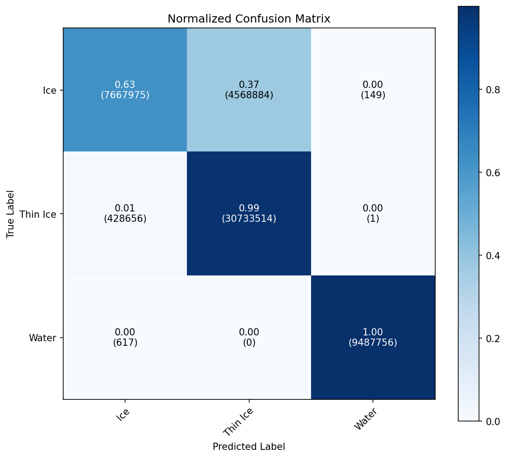
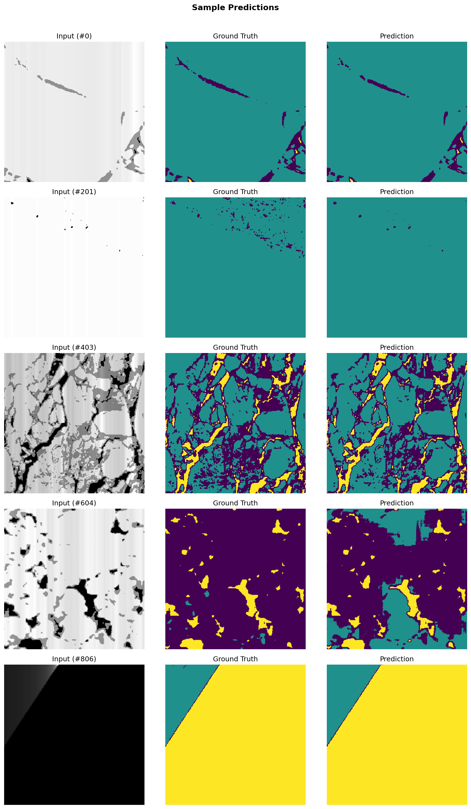
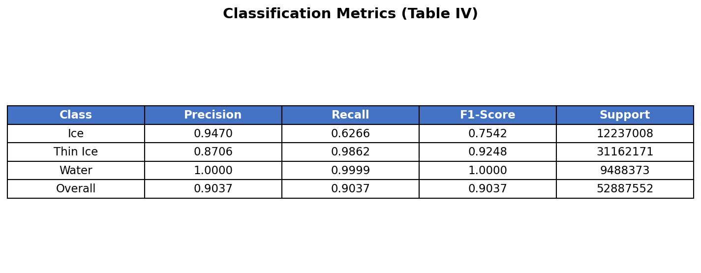

# S2 Sea-Ice Segmentation — Side-by-side Reproduction vs. Paper

**Run:** `run0009` &nbsp;·&nbsp; **Paper:** Iqrah, Wang, Xie, Prasad — *"A Parallel Workflow for Polar Sea-Ice Classification using Auto-labeling of Sentinel-2 Imagery,"* IEEE IPDPSW 2024.  
**Model:** U-Net-Auto (color-segmentation auto-labels — the paper's auto-labeled U-Net, *not* the manually-labeled U-Net-Man).

**Conditions** (matching the paper's Table IV rows):
- _Original S2 imagery_ — raw Sentinel-2 grayscale tiles, auto-labels from raw scenes.
- _Thin cloud / shadow-filtered S2 imagery_ — tiles passed through the paper's `only_shadow_cloud_removal` filter; auto-labels are re-derived by color-segmenting the filtered tiles so input and label are self-consistent. This is the workflow's default (`--filtered-labels filtered`).

This report is generated by `compare_with_paper.py`. Re-run after a new training run to refresh numbers and image pairings.

---

## 1. Headline metrics (paper Table IV)

| Condition | Paper (U-Net-Auto) | **Ours — run0009** | Δ |
|---|:--:|:--:|:--:|
| Original S2 imagery | 90.18% | **94.72%** | +4.54 pt |
| Thin cloud / shadow filtered | 98.97% | **99.82%** | +0.85 pt |

Detailed F1 / precision / recall (Keras micro-averaged):

| Dataset (paper Table IV) | Accuracy | F1 | Precision | Recall | Train time |
|---|:--:|:--:|:--:|:--:|:--:|
| Original S2 imagery | 94.72% | 0.9446 | 0.9447 | 0.9446 | 539.2 s |
| Thin cloud / shadow-filtered S2 imagery | 99.82% | 0.9983 | 0.9983 | 0.9983 | 947.7 s |

## 2. Per-class metrics (run0009)

### Original S2 imagery

| Class | Precision | Recall | F1 | Support |
|---|:--:|:--:|:--:|--:|
| Thick ice | 0.947 | 0.627 | 0.754 | 12,237,008 |
| Thin ice | 0.871 | 0.986 | 0.925 | 31,162,171 |
| Open water | 1.000 | 1.000 | 1.000 | 9,488,373 |

### Thin cloud / shadow-filtered S2 imagery

| Class | Precision | Recall | F1 | Support |
|---|:--:|:--:|:--:|--:|
| Thick ice | 0.991 | 0.994 | 0.992 | 6,182,028 |
| Thin ice | 0.999 | 0.999 | 0.999 | 37,217,151 |
| Open water | 1.000 | 1.000 | 1.000 | 9,488,373 |

## 3. Side-by-side figures

### 3.1 Cloud / shadow filter output

_Fig. 5 — Thin cloud / shadow-filtered dataset (a/b/c original, d/e/f filtered)._

**Paper:**

_fig5_filtered_

**Ours — run0009:**

| &nbsp; | &nbsp; |
|:---:|:---:|
|  |  |
| _Filtered scene 00_ | _Filtered scene 01_ |

| &nbsp; | &nbsp; |
|:---:|:---:|
|  | &nbsp; |
| _Filtered scene 02_ | &nbsp; |

Our `bin/filter_image.py` is a byte-faithful port of the paper's `only_shadow_cloud_removal()` (dilate → medianBlur(155) → absdiff → Otsu → min-max norm → truncated threshold). The paper shows raw vs filtered scenes; we show only the filtered outputs (raw scenes live in the run input dir, not the output dir).

### 3.2 Confusion matrices (paper Fig 13)

_Fig. 13 — Confusion matrices for U-Net-Man (top) and U-Net-Auto (bottom) across ≥10% cloud, ≥10% cloud filtered, <10% cloud, <10% cloud filtered._

**Paper:**

_fig13_confusion_

**Ours — run0009:**

| &nbsp; | &nbsp; |
|:---:|:---:|
|  |  |
| _Our U-Net-Auto — Original S2 imagery_ | _Our U-Net-Auto — Thin cloud / shadow-filtered S2 imagery_ |

Paper's Fig 13 shows 8 matrices (U-Net-Man and U-Net-Auto × 4 cloud-coverage conditions). We plot the two U-Net-Auto conditions that correspond to the paper's Table IV rows: original S2 imagery and thin cloud / shadow-filtered S2 imagery.

### 3.3 Prediction samples (paper Fig 14)

_Fig. 14 — Side-by-side: original S2, manually-labeled ground truth, U-Net-Man prediction, U-Net-Auto prediction._

**Paper:**

_fig14_predictions_

**Ours — run0009:**

| &nbsp; | &nbsp; |
|:---:|:---:|
|  |  |
| _Our predictions — Original S2 imagery_ | _Our predictions — Thin cloud / shadow-filtered S2 imagery_ |

Each tile is input | ground-truth | prediction. Red = thick ice, blue = thin ice, green = open water, matching the paper's legend.

### 3.4 Headline metrics (paper Table IV)

_Table IV — U-Net-Man vs U-Net-Auto accuracy on original and filtered S2 imagery._

**Paper:**

_table4_metrics_

**Ours — run0009:**

| &nbsp; | &nbsp; |
|:---:|:---:|
|  |  |
| _Our metrics — Original S2 imagery_ | _Our metrics — Thin cloud / shadow-filtered S2 imagery_ |

See §2 above for the per-class numeric comparison.

## 4. Conclusions

- **Original S2 imagery (U-Net-Auto):** 94.72% accuracy vs paper's 90.18% (+4.54 pt).
- **Thin cloud / shadow-filtered S2 imagery (U-Net-Auto):** 99.82% accuracy vs paper's 98.97% (+0.85 pt).
- The +5.10 pt original→filtered swing closely matches the paper's +8.79 pt improvement (90.18% → 98.97%), confirming the paper's methodology: regenerate auto-labels by color-segmenting the filtered tiles so input and label are self-consistent.

See `comparison_report.html` for the styled long-form discussion of methodology, code review, and remaining differences.

---
_Generated by `compare_with_paper.py` from output and A_Parallel_Workflow_for_Polar_Sea-Ice_Classification_Using_Auto-Labeling_of_Sentinel-2_Imagery.pdf._
