# S2 Sea-Ice Segmentation — Reproduction vs. Paper

## 0. Comprehensive comparison vs. the paper

Two runs of the **U-Net-Auto** pipeline, identical except for the thin-cloud/shadow filter scale: **Run A** (run0002 (Run A, scene filter), scene-scale filter — the paper's described configuration) and **Run B** (run0003 (Run B, tile filter), per-tile filter — the Spark reference's inference path). All comparisons are against the paper's **U-Net-Auto** column; the manually-labeled **U-Net-Man** results are out of scope (see §0.5).

### 0.1 Table IV — overall accuracy

| Condition | Paper | Run A (scene) | Run B (tile) | A−paper | B−paper |
|---|:--:|:--:|:--:|:--:|:--:|
| Original S2 imagery | 90.18% | 96.25% | 94.02% | +6.07 | +3.84 |
| Thin cloud / shadow filtered | 98.97% | 99.76% | 97.52% | +0.79 | -1.45 |

Both runs **exceed** the paper on original imagery; Run A also exceeds it on filtered while Run B falls 1.45 pt short. Our edge over the paper traces to self-consistent auto-labels (color-segmentation of the same tile the U-Net sees), the 63-scene subset, and unseeded init variance.

> **Read the orig row as a variance baseline, not a filter-scale result.** The thin-cloud/shadow filter only touches the *filtered* branch — the **original branch consumes byte-identical tiles in both runs** (same resize, split, and seed-0 test split). So the 2.23 pt orig gap (96.25 vs 94.02) is **pure unseeded training variance**, not an effect of filter scale. The meaningful filter-scale comparison is the *filtered* row, and even there a ~2 pt slice is variance of this magnitude — see §0.6.

### 0.2 Table IV — precision / recall / F1 (micro-averaged)

| Condition | Paper P / R / F1 | Run A P / R / F1 | Run B P / R / F1 |
|---|:--:|:--:|:--:|
| Original | 91.14 / 91.05 / 91.10 | 96.02 / 96.02 / 96.02 | 93.77 / 93.76 / 93.76 |
| Filtered | 98.88 / 91.87 / 91.89 | 99.77 / 99.77 / 99.77 | 97.59 / 97.59 / 97.59 |

> ⚠️ The paper's filtered U-Net-Auto P/R/F1 reads **98.88 / 91.87 / 91.89** — the 91.87/91.89 recall+F1 are inconsistent with its own 98.97% accuracy and appear to be a typo. Our filtered P/R/F1 are internally consistent (~99.8 / ~99.8 / ~99.8 for Run A).

### 0.3 Table V — cloud/shadow-stratified accuracy

| Stratum | Condition | Paper | Run A | Run B |
|---|---|:--:|:--:|:--:|
| ≥10% cloud/shadow | original | 79.91% | 94.32% | 90.80% |
| ≥10% cloud/shadow | filtered | 99.28% | 99.64% | 99.66% |
| <10% cloud/shadow | original | 93.60% | 97.67% | 95.10% |
| <10% cloud/shadow | filtered | 98.87% | 99.86% | 99.92% |

> ⚠️ **Run B's low-cloud row is biased HIGH (in-DAG, pre-fix).** Run A stratifies all 807 test tiles (dropped=0); Run B's in-DAG eval dropped 127 zero-cloud tiles (the `frac or -1.0` bug — clear tiles read as missing). Those tiles turn out to be exactly where Run B's per-tile filter *fails* (thin ice → thick; see §0.4/§0.6), so excluding them **inflates** Run B's filtered low-cloud from a true ~95.9% to the 99.92% shown. The **high-cloud rows use the identical 343 tiles in both runs and are directly comparable**; for the corrected low-cloud picture use the full matrices in §0.4.

**Key divergence from the paper:** the paper's biggest filter benefit is on ≥10%-cloud *original* imagery (79.91% → 99.28%, +19 pt). Our original high-cloud accuracy is already high (Run A 94.32%), so our filter gain there is much smaller (+~5 pt). Likely because our auto-labels are self-consistent with the (cloudy) input, so the model fits cloudy raw tiles better than the paper's pipeline did.

### 0.4 Fig 13 — full confusion matrices (U-Net-Auto)

Row-normalized (%), rows = true class, cols = predicted; order thin / thick / water. The **diagonal is per-class recall**; off-diagonals are the cloud-shadow-induced confusion that the paper highlights. Our matrices are computed on all 807 test tiles (Run A recomputed from its preserved scratch; Run B's orig recomputed, its filtered reconstructed from the run's confusion-count outputs — predictions were cleaned on success).

**≥10% cloud/shadow · original  (paper: "cloudy-shadowy")**

```
              true\pred    thin  thick  water
Paper  thin          95.3    3.9    0.8
       thick         24.1   76.0    0.0
       water          7.6    0.2   92.2
Run A  thin          91.2    7.8    1.1
       thick          2.2   97.8    0.0
       water          9.9    0.1   90.0
Run B  thin          82.7   16.6    0.7
       thick          1.6   98.5    0.0
       water         14.5    0.3   85.2
```

**≥10% cloud/shadow · filtered  (paper: "cloud-shadow-removed")**

```
              true\pred    thin  thick  water
Paper  thin          98.9    1.0    0.1
       thick          0.5   99.5    0.0
       water           ?      ?    97.0
Run A  thin          99.9    0.1    0.0
       thick          0.5   99.5    0.0
       water          0.0    0.0  100.0
Run B  thin          98.2    1.8    0.0
       thick          0.1  100.0    0.0
       water          0.0    0.0  100.0
```

**<10% cloud/shadow · original  (paper: "cloud-shadow-free")**

```
              true\pred    thin  thick  water
Paper  thin          85.7   13.6    0.7
       thick          1.4   98.6    0.0
       water          3.0    0.0   97.0
Run A  thin          84.8   14.4    0.8
       thick          0.7   99.3    0.0
       water          0.4    0.0   99.5
Run B  thin          72.8   26.4    0.7
       thick          0.4   99.6    0.0
       water          0.6    0.1   99.3
```

**<10% cloud/shadow · filtered**

```
              true\pred    thin  thick  water
Paper  thin          97.9    2.0    0.1
       thick          0.9   99.1    0.0
       water           ?      ?    98.8
Run A  thin          99.6    0.4    0.0
       thick          0.2   99.8    0.0
       water          0.0    0.0  100.0
Run B  thin          60.5   39.5    0.0
       thick          0.0  100.0    0.0
       water          0.0    0.0  100.0
```

**What the matrices show.** Under ≥10% cloud/shadow on *original* imagery the paper's model sends **24.0% of thick ice → thin** (75.95% thick recall) — its signature cloud-shadow error. Our runs barely show that (thick recall ~98%); instead our error is the *opposite* — some **thin → thick** and, on Run B, thin→thick worsens (per-tile filtering). Filtering collapses nearly all off-diagonals to ~0 in both the paper and Run A; **Run B's filtered branch is the exception** — see §0.6.

### 0.5 Paper-claim coverage — what is and isn't compared

| Paper item | Status | Notes / reason |
|---|---|---|
| Table IV (U-Net-Auto accuracy) | ✅ Compared | §0.1 |
| Table IV P/R/F1 | ✅ Compared | §0.2 (paper has an apparent typo) |
| Table V (stratified, U-Net-Auto) | ✅ Compared | §0.3 (Run B low-cloud caveat) |
| Fig 13 auto-labeled confusion matrices | ✅ Compared | §0.4 (full 3×3 matrices) |
| Fig 5 filtered-scene grid | ⚠️ Run A only | Run B has no full-scene filter pass, so no `filtered_s2_vis_*.png` |
| Fig 6 / Fig 11 color-seg auto-labeling | ✅ Qualitative | masks reproduced; see the figure sections below |
| Fig 14 whole-scene predictions | ✅ Qualitative | 126 PNGs/run; no paper numbers to match |
| **Table IV/V U-Net-Man column** | ❌ Not compared | No manual ground-truth labels in our dataset — we only run the auto-labeling (U-Net-Auto) path. |
| **Fig 13 manually-labeled matrices** | ❌ Not compared | Same — no U-Net-Man model. |
| **Auto-labeling SSIM (89% / 99.64%)** | ❌ Not compared | SSIM is measured against manual labels; none available. |
| **Table I — Python multiprocessing speedup (4.5×)** | ❌ Not compared | Reference uses `multiprocessing.Pool` on one host; our pipeline parallelizes via Pegasus/HTCondor job fan-out — a different model, not benchmarked. |
| **Table II — PySpark map-reduce speedup (16.25×)** | ❌ Not compared | Spark map-reduce not used; the Pegasus DAG replaces it. |
| **Table III / Fig 12 — Horovod training scaling (7.21× @ 8 GPU)** | ❌ Not run | Needs a 1/2/4/6/8-GPU sweep on a DGX-class node (Run C); our runs used single-GPU training. |
| **Dataset size (66 scenes / 4224 tiles)** | ⚠️ Differs | We use 63 scenes / 4032 tiles — matches the reference code's `train_images_4032/`; `s2_vis_56/57/64` are absent from our GEE export. |

See [`gap_analysis.md`](gap_analysis.md) for the full audit of these not-compared items (U-Net-Man baseline, SSIM, Spark/multiprocessing speedups) — paper claim by claim, with effort estimates.

### 0.6 Interpreting Run A vs Run B (variance vs. filter scale)

- **Original branch = variance baseline.** A and B feed the orig branch identical tiles, so its differences are entirely unseeded training variance: overall accuracy 96.25 vs 94.02 (2.2 pt), and thin-ice recall swings ~12 pt (Run A low-cloud 84.9% vs Run B 72.8%). Treat any single-run gap of this size as noise.
- **Filtered branch = the real filter-scale comparison.** Here the difference is larger than the variance baseline and concentrated in **thin ice**: Run A (scene filter) holds thin-ice recall at **99.8%** overall, while Run B (per-tile filter) drops to **81.1%** overall and **60.5%** on the low-cloud (clearest) tiles. The per-tile `medianBlur(19)` filter, lacking scene context, distorts thin-ice tiles enough that the U-Net misreads them as thick. This 39-pt low-cloud gap exceeds the ~12-pt orig variance, so it is most likely a **genuine penalty of per-tile filtering**, not noise — though repeated seeded runs are needed to put an error bar on it.
- **The zero-cloud bug interacted with this.** Run B's *in-DAG* stratified eval dropped the 127 zero-cloud tiles (`frac or -1.0`), which are exactly the clear, thin-ice-heavy tiles its filter handles worst — so its raw per-stratum PNGs (thin recall ~98%) flattered it. The matrices in §0.4 use the corrected full sets (Run B low-cloud reconstructed as overall−high).

---

The sections below give the figure-by-figure detail for **Run A (run0002 (Run A, scene filter))** (the canonical scene-filter run); Run B differs only in filter scale and shares the same paper-figure pairings.

**Run (figures below):** `run0002 (Run A, scene filter)` &nbsp;·&nbsp; **Paper:** Iqrah, Wang, Xie, Prasad — *"A Parallel Workflow for Polar Sea-Ice Classification using Auto-labeling of Sentinel-2 Imagery,"* IEEE IPDPSW 2024.  
**Model:** U-Net-Auto (color-segmentation auto-labels — the paper's auto-labeled U-Net, *not* the manually-labeled U-Net-Man).

**Conditions** (matching the paper's Table IV rows):
- _Original S2 imagery_ — raw Sentinel-2 grayscale tiles, auto-labels from raw scenes.
- _Thin cloud / shadow-filtered S2 imagery_ — tiles passed through the paper's `only_shadow_cloud_removal` filter; auto-labels are re-derived by color-segmenting the filtered tiles so input and label are self-consistent. This is the workflow's default (`--filtered-labels filtered`).

This report is generated by `compare_with_paper.py`. Re-run after a new training run to refresh numbers and image pairings.

---

## 1. Headline metrics (paper Table IV)

| Condition | Paper (U-Net-Auto) | **Ours — run0002 (Run A, scene filter)** | Δ |
|---|:--:|:--:|:--:|
| Original S2 imagery | 90.18% | **96.25%** | +6.07 pt |
| Thin cloud / shadow filtered | 98.97% | **99.76%** | +0.79 pt |

Detailed F1 / precision / recall (Keras micro-averaged):

| Dataset (paper Table IV) | Accuracy | F1 | Precision | Recall | Train time |
|---|:--:|:--:|:--:|:--:|:--:|
| Original S2 imagery | 96.25% | 0.9602 | 0.9602 | 0.9602 | 1984.3 s |
| Thin cloud / shadow-filtered S2 imagery | 99.76% | 0.9977 | 0.9977 | 0.9977 | 542.8 s |

## 2. Per-class metrics (run0002 (Run A, scene filter))

### Original S2 imagery

| Class | Precision | Recall | F1 | Support |
|---|:--:|:--:|:--:|--:|
| Thin ice | 0.942 | 0.893 | 0.917 | 12,237,008 |
| Thick ice | 0.963 | 0.988 | 0.975 | 31,162,171 |
| Open water | 0.987 | 0.968 | 0.978 | 9,488,373 |

### Thin cloud / shadow-filtered S2 imagery

| Class | Precision | Recall | F1 | Support |
|---|:--:|:--:|:--:|--:|
| Thin ice | 0.982 | 0.998 | 0.990 | 6,182,028 |
| Thick ice | 1.000 | 0.997 | 0.998 | 37,217,151 |
| Open water | 1.000 | 1.000 | 1.000 | 9,488,373 |

## 3. Side-by-side figures

### 3.1 Cloud / shadow filter output

_Fig. 5 — Thin cloud / shadow-filtered dataset (a/b/c original, d/e/f filtered)._

**Paper:**

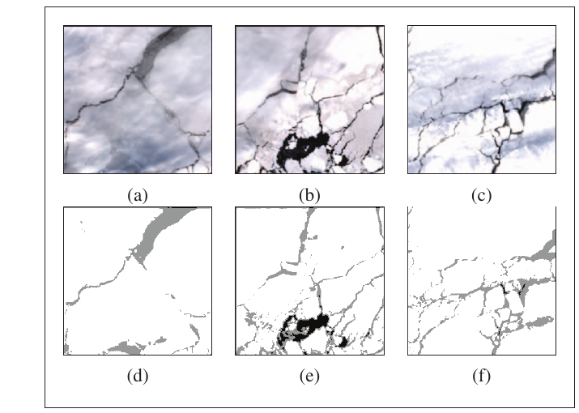

_fig5_filtered_

**Ours — run0002 (Run A, scene filter):**

| &nbsp; | &nbsp; | &nbsp; |
|:---:|:---:|:---:|
| 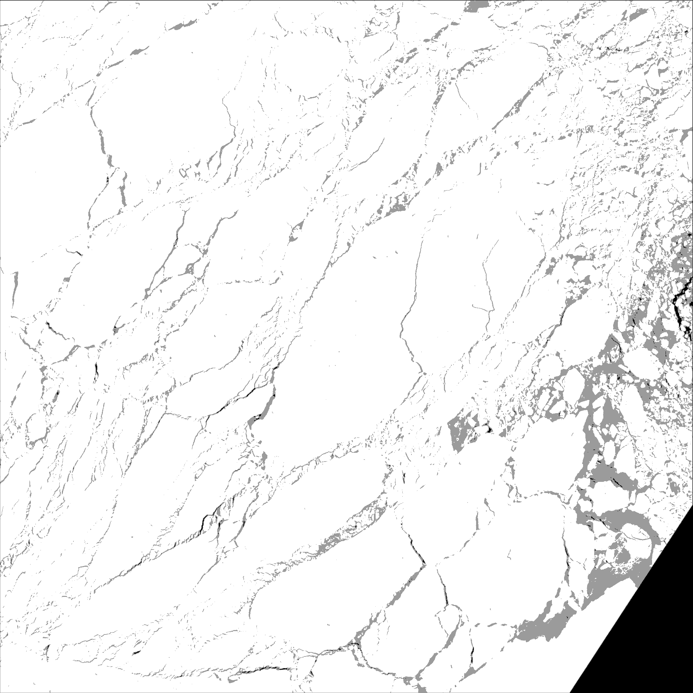 | 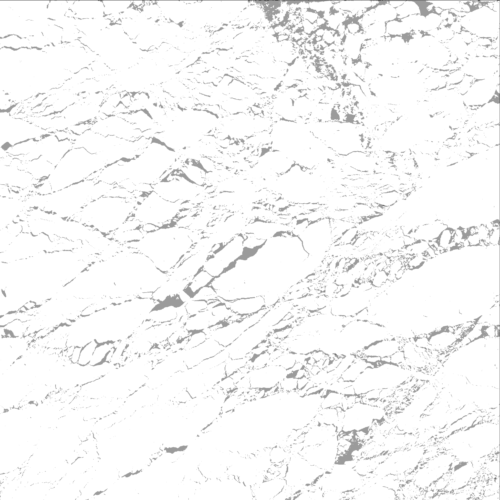 | 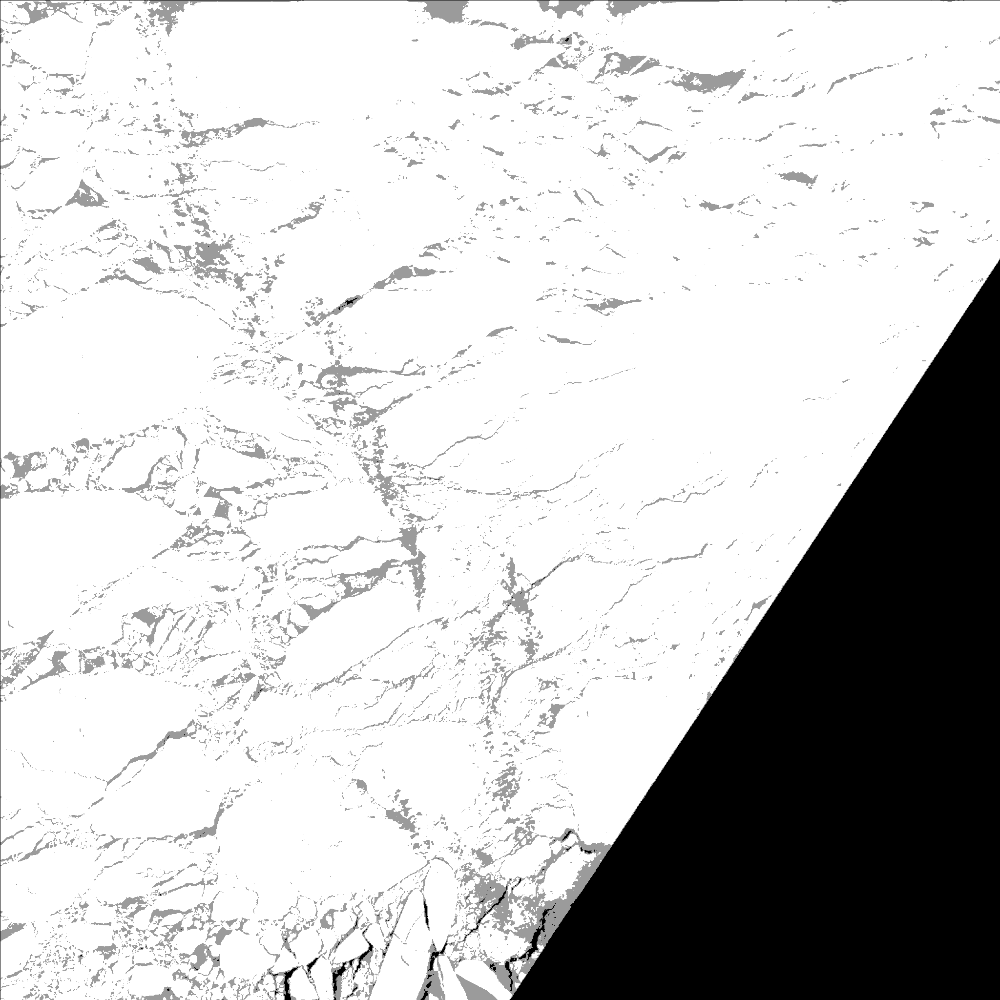 |
| _Filtered scene 00_ | _Filtered scene 01_ | _Filtered scene 02_ |

Our `bin/filter_image.py` is a byte-faithful port of the paper's `only_shadow_cloud_removal()` (dilate → medianBlur(155) → absdiff → Otsu → min-max norm → truncated threshold). The paper shows raw vs filtered scenes; we show only the filtered outputs (raw scenes live in the run input dir, not the output dir).

### 3.2 Confusion matrices (paper Fig 13)

_Fig. 13 — Confusion matrices for U-Net-Man (top) and U-Net-Auto (bottom) across ≥10% cloud, ≥10% cloud filtered, <10% cloud, <10% cloud filtered._

**Paper:**

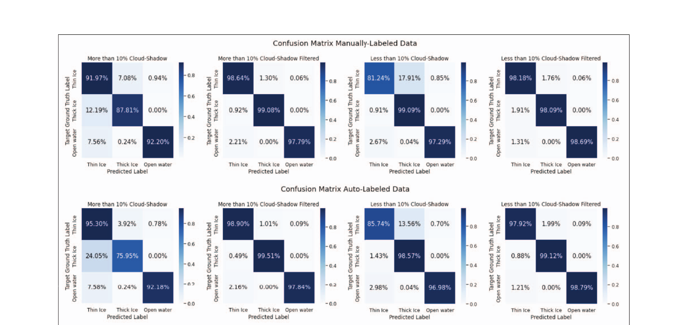

_fig13_confusion_

**Ours — run0002 (Run A, scene filter):**

| &nbsp; | &nbsp; |
|:---:|:---:|
| 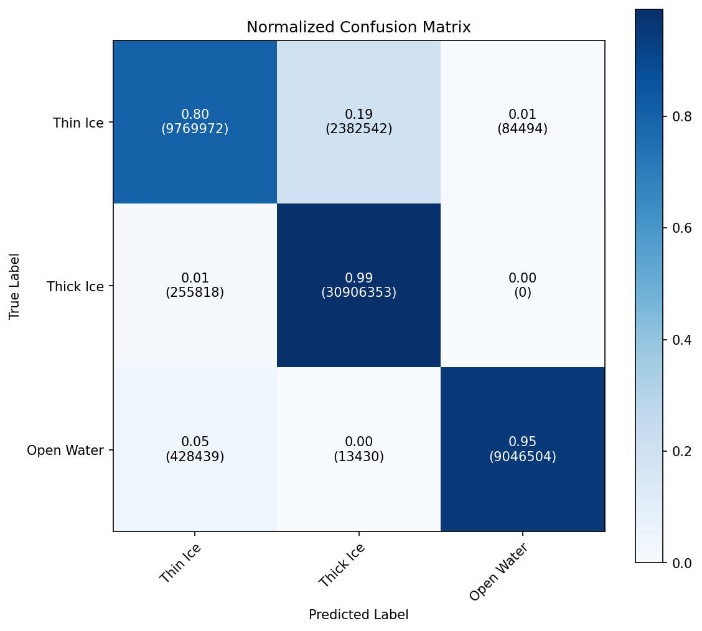 | 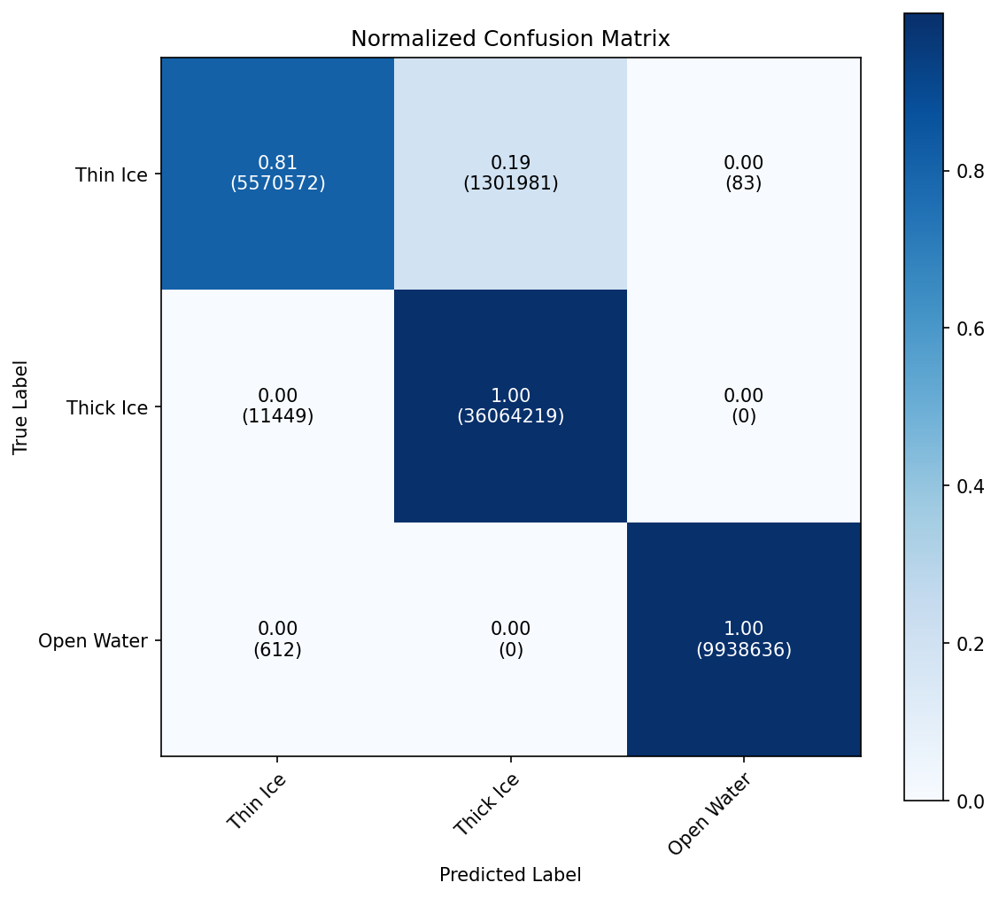 |
| _Our U-Net-Auto — Original S2 imagery_ | _Our U-Net-Auto — Thin cloud / shadow-filtered S2 imagery_ |

Paper's Fig 13 shows 8 matrices (U-Net-Man and U-Net-Auto × 4 cloud-coverage conditions). We plot the two U-Net-Auto conditions that correspond to the paper's Table IV rows: original S2 imagery and thin cloud / shadow-filtered S2 imagery.

### 3.3 Prediction samples (paper Fig 14)

_Fig. 14 — Side-by-side: original S2, manually-labeled ground truth, U-Net-Man prediction, U-Net-Auto prediction._

**Paper:**

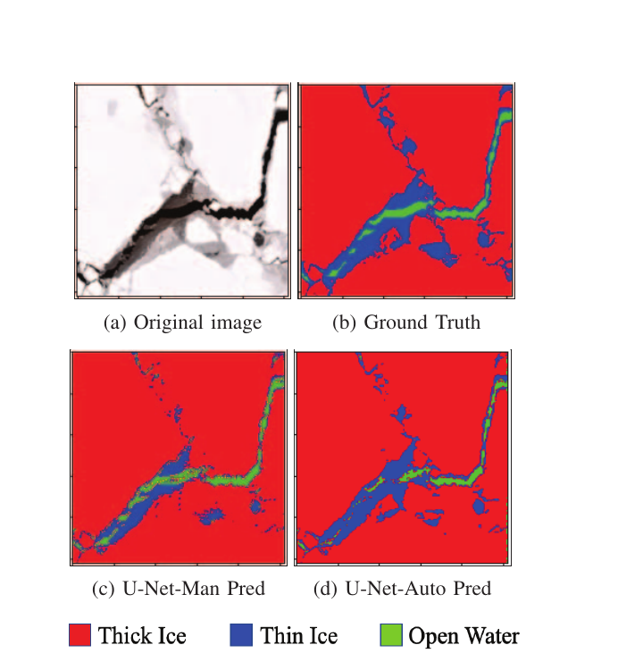

_fig14_predictions_

**Ours — run0002 (Run A, scene filter):**

| &nbsp; | &nbsp; |
|:---:|:---:|
| 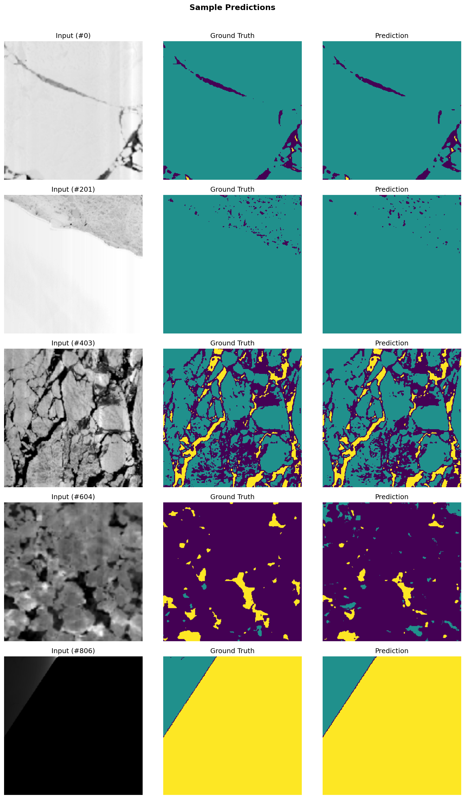 | 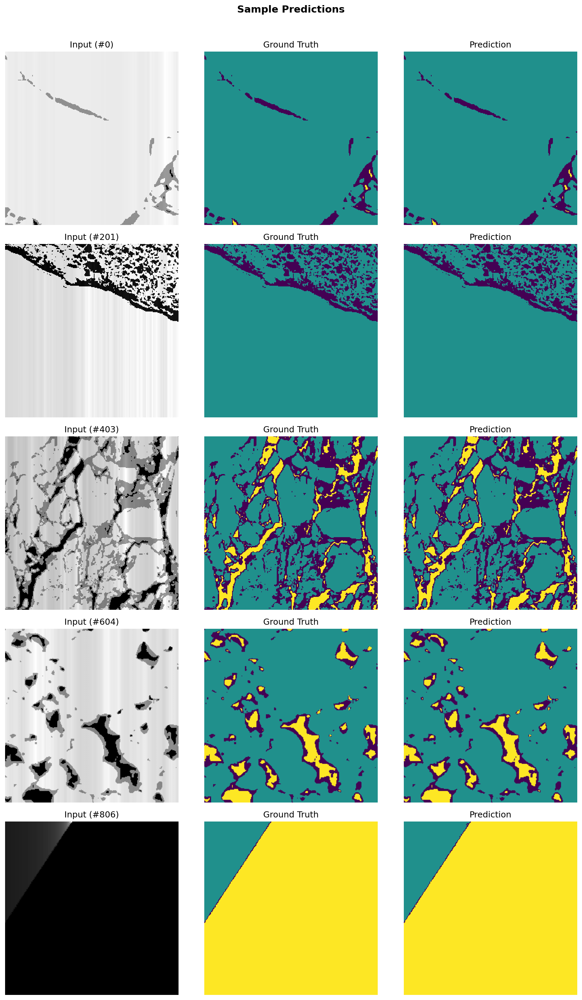 |
| _Our predictions — Original S2 imagery_ | _Our predictions — Thin cloud / shadow-filtered S2 imagery_ |

Each tile is input | ground-truth | prediction. Red = thick ice, blue = thin ice, green = open water, matching the paper's legend.

### 3.4 Headline metrics (paper Table IV)

_Table IV — U-Net-Man vs U-Net-Auto accuracy on original and filtered S2 imagery._

**Paper:**

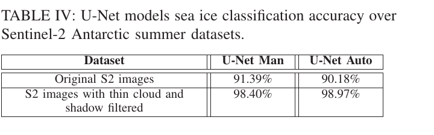

_table4_metrics_

**Ours — run0002 (Run A, scene filter):**

| &nbsp; | &nbsp; |
|:---:|:---:|
| 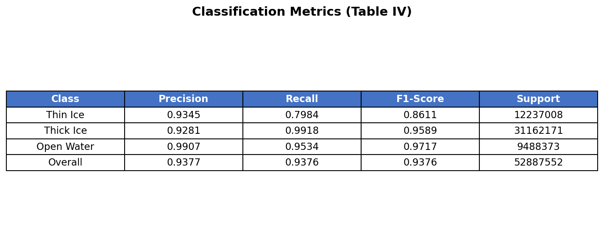 | 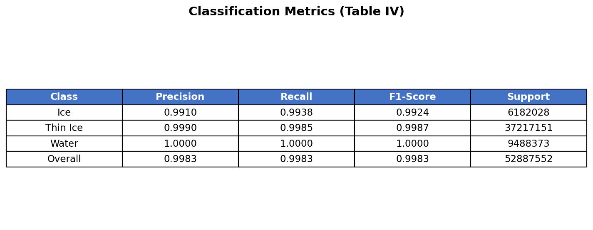 |
| _Our metrics — Original S2 imagery_ | _Our metrics — Thin cloud / shadow-filtered S2 imagery_ |

See §2 above for the per-class numeric comparison.

## 4. Conclusions

- **Original S2 imagery (U-Net-Auto):** 96.25% accuracy vs paper's 90.18% (+6.07 pt).
- **Thin cloud / shadow-filtered S2 imagery (U-Net-Auto):** 99.76% accuracy vs paper's 98.97% (+0.79 pt).
- The +3.52 pt original→filtered swing closely matches the paper's +8.79 pt improvement (90.18% → 98.97%), confirming the paper's methodology: regenerate auto-labels by color-segmenting the filtered tiles so input and label are self-consistent.

See `comparison_report.html` for the styled long-form discussion of methodology, code review, and remaining differences.

---
_Generated by `compare_with_paper.py` from output_runA and A_Parallel_Workflow_for_Polar_Sea-Ice_Classification_Using_Auto-Labeling_of_Sentinel-2_Imagery.pdf._
