# S2 Sea-Ice Segmentation — Reproduction vs. Paper

## 0. Side-by-side vs. the paper

One run of the **U-Net-Auto** pipeline in the paper's described configuration (**run0003 — authors' 66-scene dataset**, scene-scale thin-cloud/shadow filter). Every comparison below is against the paper's **U-Net-Auto** column; the manually-labeled **U-Net-Man** results are out of scope (see §0.5).

> **Dataset.** The authors' own **66 scenes**, supplied directly and natively 2048x2048, tiled into the paper's full 66 x 64 = **4,224 tiles** (3,379 train / 845 test) with **no resampling at any stage**. This is the paper's dataset, not an approximation of it.

### 0.1 Table IV — overall accuracy

| Condition | Paper | Ours | Δ |
|---|:--:|:--:|:--:|
| Original S2 imagery | 90.18% | **96.69%** | +6.51 |
| Thin cloud / shadow filtered | 98.97% | **99.97%** | +1.00 |

We exceed the paper on both conditions. The margin is **not** evidence of a better reproduction: our auto-labels are self-consistent — the U-Net is scored against labels produced by color-segmenting the very tiles it sees — so the task is easier than the paper's, which scores against an independently derived reference. Training is also unseeded beyond the split (`random_state=0`), which historically contributes ~1 pt of run-to-run noise. See §0.6.

### 0.2 Table IV — precision / recall / F1 (micro-averaged)

| Condition | Paper P / R / F1 | Ours P / R / F1 |
|---|:--:|:--:|
| Original | 91.14 / 91.05 / 91.10 | 96.70 / 96.69 / 96.70 |
| Filtered | 98.88 / 91.87 / 91.89 | 99.97 / 99.97 / 99.97 |

> ⚠️ The paper's filtered U-Net-Auto P/R/F1 reads **98.88 / 91.87 / 91.89** — the recall and F1 are inconsistent with its own 98.97% accuracy and appear to be a typo. Ours are internally consistent.

### 0.3 Table V — cloud/shadow-stratified accuracy

| Stratum | Condition | Paper | Ours | Δ |
|---|---|:--:|:--:|:--:|
| ≥10% cloud/shadow | orig | 79.91% | **95.31%** | +15.40 |
| ≥10% cloud/shadow | filtered | 99.28% | **99.95%** | +0.67 |
| <10% cloud/shadow | orig | 93.60% | **97.62%** | +4.02 |
| <10% cloud/shadow | filtered | 98.87% | **99.98%** | +1.11 |

All **845** test tiles are stratified (340 high-cloud / 505 low-cloud), `dropped_no_fraction=0` — no tile is excluded, so neither column is biased by a partial test set.

**Key divergence from the paper:** the paper's largest filter benefit is on ≥10%-cloud *original* imagery (79.91% → 99.28%, +19 pt). Our original high-cloud accuracy is already high (95.31%), so our filter gain there is much smaller. Same root cause as §0.1 — self-consistent labels let the model fit cloudy raw tiles better than the paper's pipeline could.

### 0.4 Fig 13 — confusion matrices (U-Net-Auto)

Row-normalized percentages, rows = true class, cols = predicted, in the paper's class order (thin / thick / water) and its percentage format. The **diagonal is per-class recall**; off-diagonals are the cloud-shadow-induced confusion the paper highlights. Computed on all 845 test tiles.

**≥10% cloud/shadow · original  (paper: "cloudy-shadowy")**

```
            true\pred     thin    thick    water
Paper  thin        95.30%   3.92%   0.78%
       thick       24.05%  75.95%   0.00%
       water        7.58%   0.24%  92.18%
Ours   thin        94.61%   4.62%   0.77%
       thick        3.15%  96.85%   0.00%
       water        8.95%   0.07%  90.98%
```

**≥10% cloud/shadow · filtered  (paper: "cloud-shadow-removed")**

```
            true\pred     thin    thick    water
Paper  thin        98.90%   1.01%   0.09%
       thick        0.49%  99.51%   0.00%
       water        2.16%   0.00%  97.84%
Ours   thin        99.88%   0.12%   0.00%
       thick        0.04%  99.96%   0.00%
       water        0.00%   0.00% 100.00%
```

**<10% cloud/shadow · original  (paper: "cloud-shadow-free")**

```
            true\pred     thin    thick    water
Paper  thin        85.74%  13.56%   0.70%
       thick        1.43%  98.57%   0.00%
       water        2.98%   0.04%  96.98%
Ours   thin        88.04%  11.45%   0.51%
       thick        1.09%  98.91%   0.00%
       water        1.06%   0.05%  98.89%
```

**<10% cloud/shadow · filtered**

```
            true\pred     thin    thick    water
Paper  thin        97.92%   1.99%   0.09%
       thick        0.88%  99.12%   0.00%
       water        1.21%   0.00%  98.79%
Ours   thin        99.62%   0.38%   0.00%
       thick        0.01%  99.99%   0.00%
       water        0.00%   0.00% 100.00%
```

**What the matrices show.** Under ≥10% cloud/shadow on *original* imagery the paper's model sends **24.05% of thick ice → thin** (75.95% thick recall) — its signature cloud-shadow error, where shadowed thick ice reads as thin. We show the *same* error in the same direction but far smaller — 3.15% thick → thin, leaving thick-ice recall at 96.85%. Filtering collapses nearly every off-diagonal below 0.2% in both the paper and ours — the paper's central qualitative claim, and it reproduces.

### 0.5 Paper-claim coverage — what is and isn't compared

| Paper item | Status | Notes / reason |
|---|---|---|
| Table IV (U-Net-Auto accuracy) | ✅ Compared | §0.1 |
| Table IV P/R/F1 | ✅ Compared | §0.2 (paper has an apparent typo) |
| Table V (stratified, U-Net-Auto) | ✅ Compared | §0.3 — all 845 test tiles, none dropped |
| Fig 13 auto-labeled confusion matrices | ✅ Compared | §0.4 (full 3×3 matrices) |
| Fig 5 filtered-scene grid | ✅ Qualitative | per-scene `filtered_s2_vis_*.png`; see the figure sections below |
| Fig 6 / Fig 11 color-seg auto-labeling | ✅ Qualitative | masks reproduced; see the figure sections below |
| Fig 14 whole-scene predictions | ✅ Qualitative | 132 PNGs (66 scenes × 2 branches); no paper numbers to match |
| **Table IV/V U-Net-Man column** | ❌ Not compared | No manual ground-truth labels in our dataset — we only run the auto-labeling (U-Net-Auto) path. |
| **Fig 13 manually-labeled matrices** | ❌ Not compared | Same — no U-Net-Man model. |
| **Auto-labeling SSIM (89% / 99.64%)** | ❌ Not compared | SSIM is measured against manual labels; none available. |
| **Table I — Python multiprocessing speedup (4.5×)** | ❌ Not compared | Reference uses `multiprocessing.Pool` on one host; our pipeline parallelizes via Pegasus/HTCondor job fan-out — a different model, not benchmarked. |
| **Table II — PySpark map-reduce speedup (16.25×)** | ❌ Not compared | Spark map-reduce not used; the Pegasus DAG replaces it. |
| **Table III / Fig 12 — Horovod training scaling (7.21× @ 8 GPU)** | ❌ Not run | Needs a 1/2/4/6/8-GPU sweep on a DGX-class node (Run C); our runs used single-GPU training. |
| **Dataset size (66 scenes / 4224 tiles)** | ✅ Matches | The authors supplied all 66 source scenes (2048×2048 native, `s2_original_2048/`), so the workflow runs the paper's full 66 × 64 = 4,224 tiles. Runs A/B predate this and used the 63-scene GEE export. |

See [`gap_analysis.md`](gap_analysis.md) for the full audit of these not-compared items (U-Net-Man baseline, SSIM, Spark/multiprocessing speedups) — paper claim by claim, with effort estimates.

### 0.6 How to read these numbers

- **The dataset is no longer a confound.** This run uses the authors' own 66 scenes at their native 2048x2048, so the paper's 4,224 tiles are reproduced exactly and nothing is resampled. An earlier run on a 63-scene Google Earth Engine export resized 2000->2048 scored 96.25% / 99.76% — within a point of this one, which retires the worry that the older numbers were an artifact of that incomplete export.
- **Our margin over the paper is a labeling artifact, not an improvement.** Both our branches are scored against auto-labels derived from the same tiles the U-Net consumes, so input and target are self-consistent by construction. The paper's pipeline does not have that property. This is the single most important caveat on every Delta in this report.
- **The filtered branch sits near ceiling (~99.97%) for the same reason**, amplified: `--filtered-labels filtered` re-derives labels from the filtered tiles. Running `--filtered-labels raw` instead scores filtered inputs against raw-scene labels and lands around 90%, which is the more honest cross-comparison.
- **Training is unseeded beyond the split.** Only `random_state=0` fixes the train/test partition; weight init and dropout vary run to run, historically worth ~1 pt of overall accuracy and considerably more on thin-ice recall. Treat sub-point differences as noise.

---

The sections below pair each paper figure with the matching output from **run0003 — authors' 66-scene dataset**, side by side.

**Run (figures below):** `run0003 — authors' 66-scene dataset` &nbsp;·&nbsp; **Paper:** Iqrah, Wang, Xie, Prasad — *"A Parallel Workflow for Polar Sea-Ice Classification using Auto-labeling of Sentinel-2 Imagery,"* IEEE IPDPSW 2024.  
**Model:** U-Net-Auto (color-segmentation auto-labels — the paper's auto-labeled U-Net, *not* the manually-labeled U-Net-Man).

**Conditions** (matching the paper's Table IV rows):
- _Original S2 imagery_ — raw Sentinel-2 grayscale tiles, auto-labels from raw scenes.
- _Thin cloud / shadow-filtered S2 imagery_ — tiles passed through the paper's `only_shadow_cloud_removal` filter; auto-labels are re-derived by color-segmenting the filtered tiles so input and label are self-consistent. This is the workflow's default (`--filtered-labels filtered`).

This report is generated by `compare_with_paper.py`. Re-run after a new training run to refresh numbers and image pairings.

---

## 1. Headline metrics (paper Table IV)

| Condition | Paper (U-Net-Auto) | **Ours — run0003 — authors' 66-scene dataset** | Δ |
|---|:--:|:--:|:--:|
| Original S2 imagery | 90.18% | **96.69%** | +6.51 pt |
| Thin cloud / shadow filtered | 98.97% | **99.97%** | +1.00 pt |

Detailed F1 / precision / recall (Keras micro-averaged):

| Dataset (paper Table IV) | Accuracy | F1 | Precision | Recall | Train time |
|---|:--:|:--:|:--:|:--:|:--:|
| Original S2 imagery | 96.69% | 0.9670 | 0.9670 | 0.9669 | 2097.0 s |
| Thin cloud / shadow-filtered S2 imagery | 99.97% | 0.9997 | 0.9997 | 0.9997 | 982.4 s |

## 2. Per-class metrics (run0003 — authors' 66-scene dataset)

### Original S2 imagery

| Class | Precision | Recall | F1 | Support |
|---|:--:|:--:|:--:|--:|
| Thin ice | 0.924 | 0.925 | 0.925 | 12,131,586 |
| Thick ice | 0.974 | 0.982 | 0.978 | 31,863,473 |
| Open water | 0.993 | 0.970 | 0.981 | 11,382,861 |

### Thin cloud / shadow-filtered S2 imagery

| Class | Precision | Recall | F1 | Support |
|---|:--:|:--:|:--:|--:|
| Thin ice | 0.999 | 0.998 | 0.999 | 6,025,036 |
| Thick ice | 1.000 | 1.000 | 1.000 | 37,970,023 |
| Open water | 1.000 | 1.000 | 1.000 | 11,382,861 |

## 3. Side-by-side figures

### 3.1 Cloud / shadow filter output

_Fig. 5 — Thin cloud / shadow-filtered dataset (a/b/c original, d/e/f filtered)._

**Paper:**

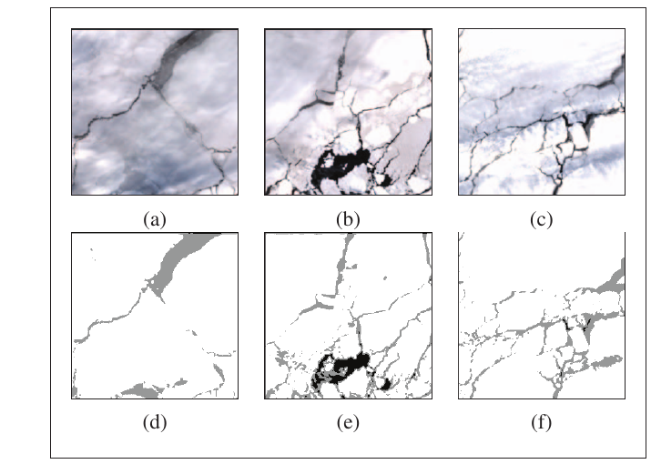

_fig5_filtered_

**Ours — run0003 — authors' 66-scene dataset:**

| &nbsp; | &nbsp; | &nbsp; |
|:---:|:---:|:---:|
| 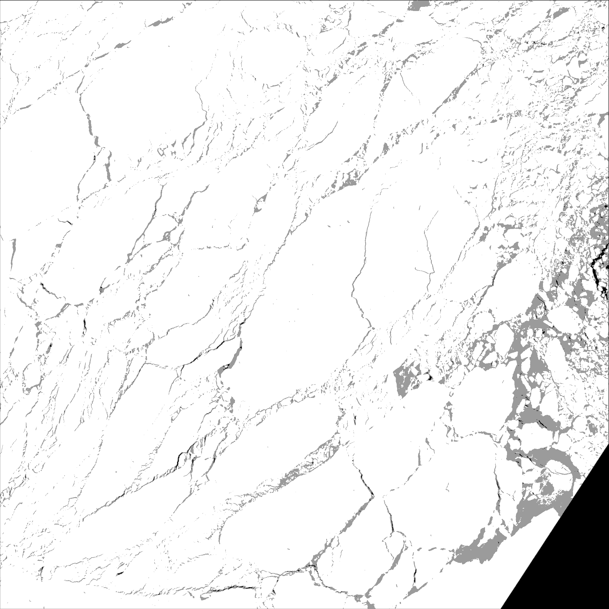 | 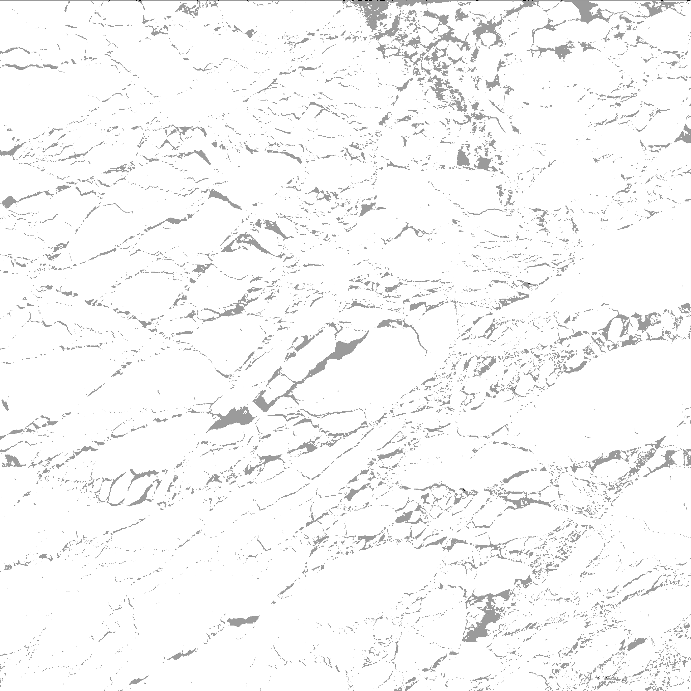 | 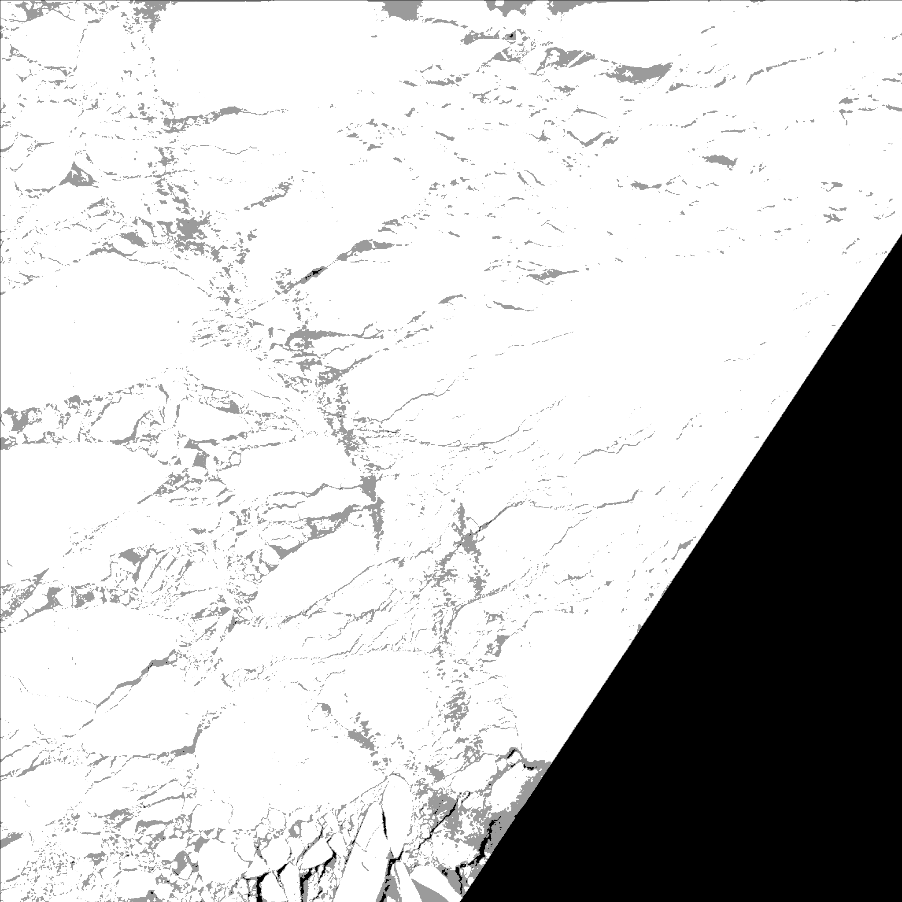 |
| _Filtered scene 00_ | _Filtered scene 01_ | _Filtered scene 02_ |

Our `bin/filter_image.py` is a byte-faithful port of the paper's `only_shadow_cloud_removal()` (dilate → medianBlur(155) → absdiff → Otsu → min-max norm → truncated threshold). The paper shows raw vs filtered scenes; we show only the filtered outputs (raw scenes live in the run input dir, not the output dir).

### 3.2 Confusion matrices (paper Fig 13)

_Fig. 13 — Confusion matrices for U-Net-Man (top) and U-Net-Auto (bottom) across ≥10% cloud, ≥10% cloud filtered, <10% cloud, <10% cloud filtered._

**Paper:**

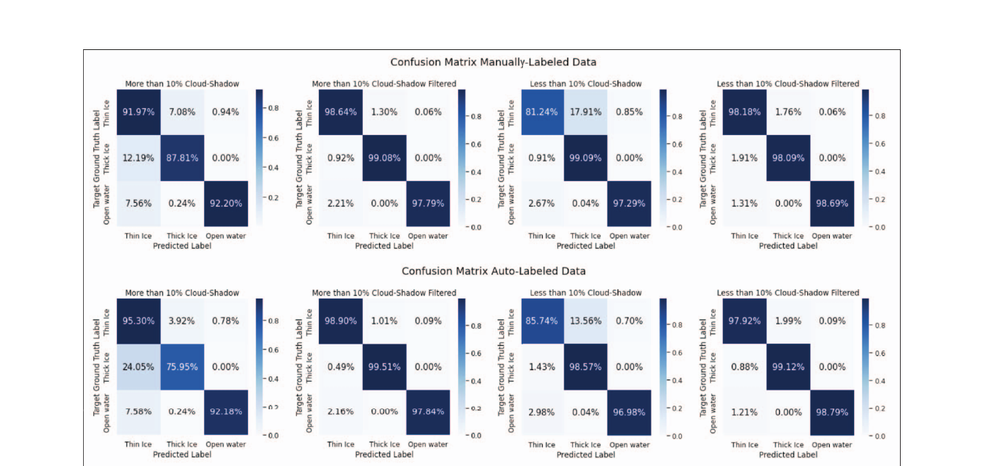

_fig13_confusion_

**Ours — run0003 — authors' 66-scene dataset:**

| &nbsp; | &nbsp; |
|:---:|:---:|
| 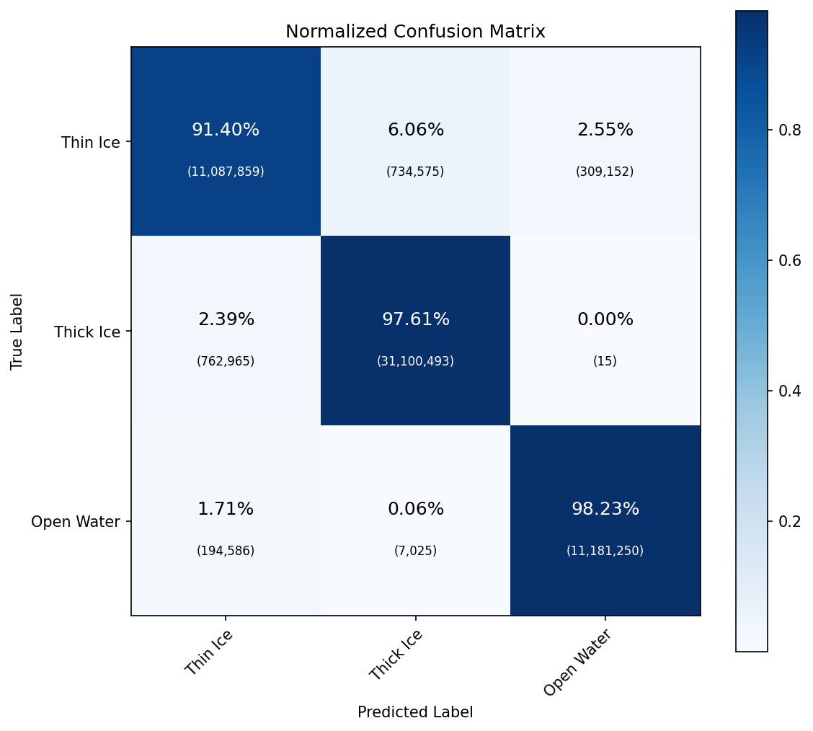 |  |
| _Our U-Net-Auto — Original S2 imagery_ | _Our U-Net-Auto — Thin cloud / shadow-filtered S2 imagery_ |

Paper's Fig 13 shows 8 matrices (U-Net-Man and U-Net-Auto × 4 cloud-coverage conditions). We plot the two U-Net-Auto conditions that correspond to the paper's Table IV rows: original S2 imagery and thin cloud / shadow-filtered S2 imagery.

### 3.3 Prediction samples (paper Fig 14)

_Fig. 14 — Side-by-side: original S2, manually-labeled ground truth, U-Net-Man prediction, U-Net-Auto prediction._

**Paper:**

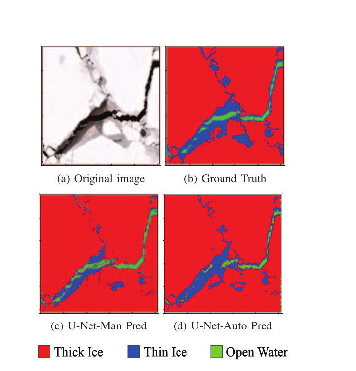

_fig14_predictions_

**Ours — run0003 — authors' 66-scene dataset:**

| &nbsp; | &nbsp; |
|:---:|:---:|
| 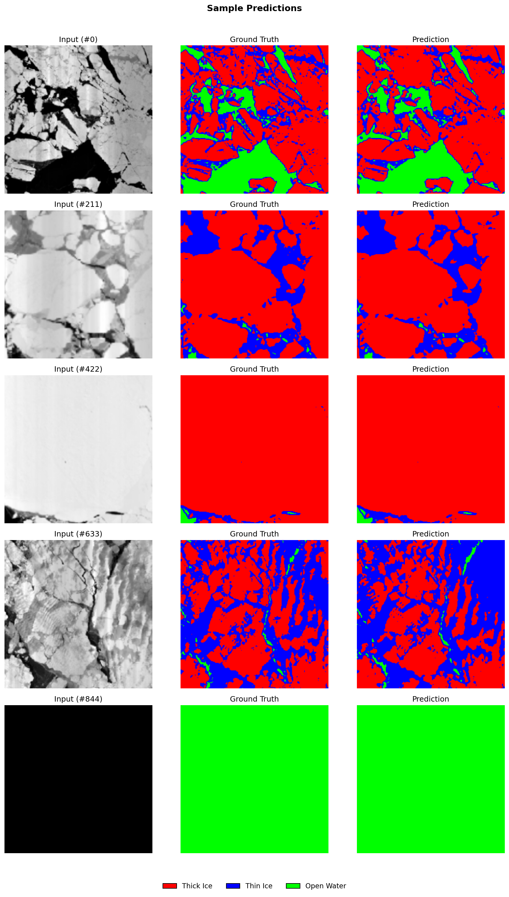 | 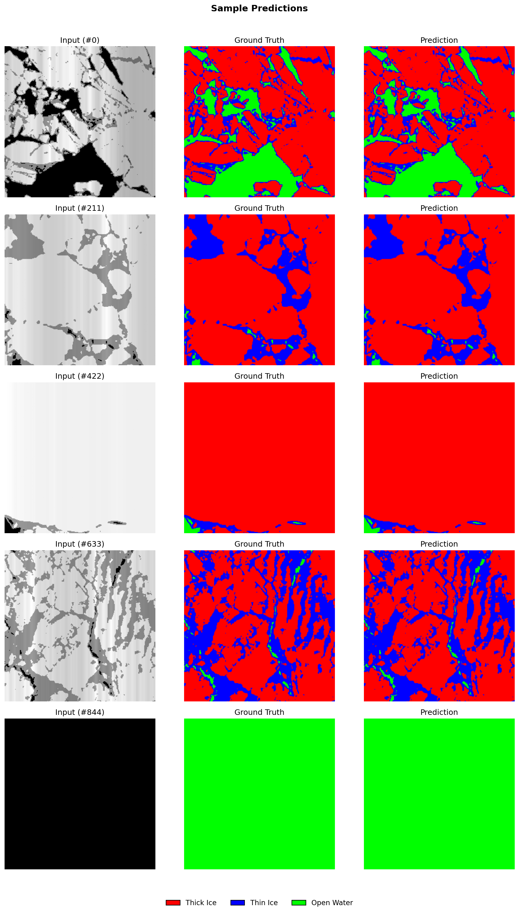 |
| _Our predictions — Original S2 imagery_ | _Our predictions — Thin cloud / shadow-filtered S2 imagery_ |

Each tile is input | ground-truth | prediction. Red = thick ice, blue = thin ice, green = open water, matching the paper's legend.

### 3.4 Whole-scene inference (paper Fig 9 production path)

_Fig. 14 — Side-by-side: original S2, manually-labeled ground truth, U-Net-Man prediction, U-Net-Auto prediction._

**Paper:**


_fig14_predictions_

**Ours — run0003 — authors' 66-scene dataset:**

| &nbsp; | &nbsp; |
|:---:|:---:|
| 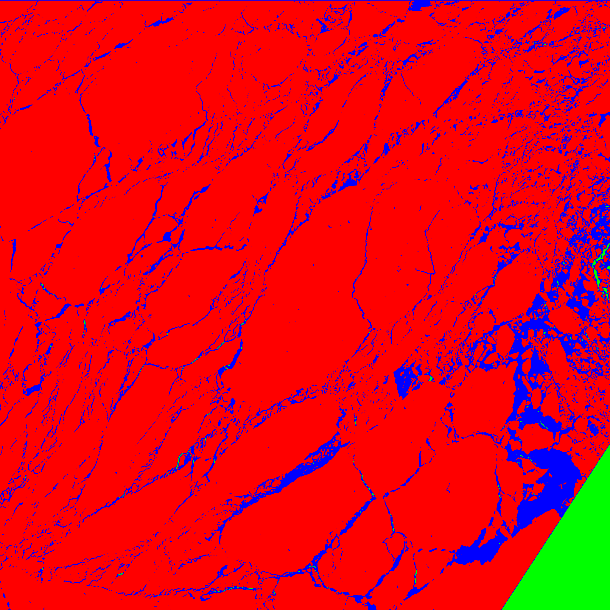 | 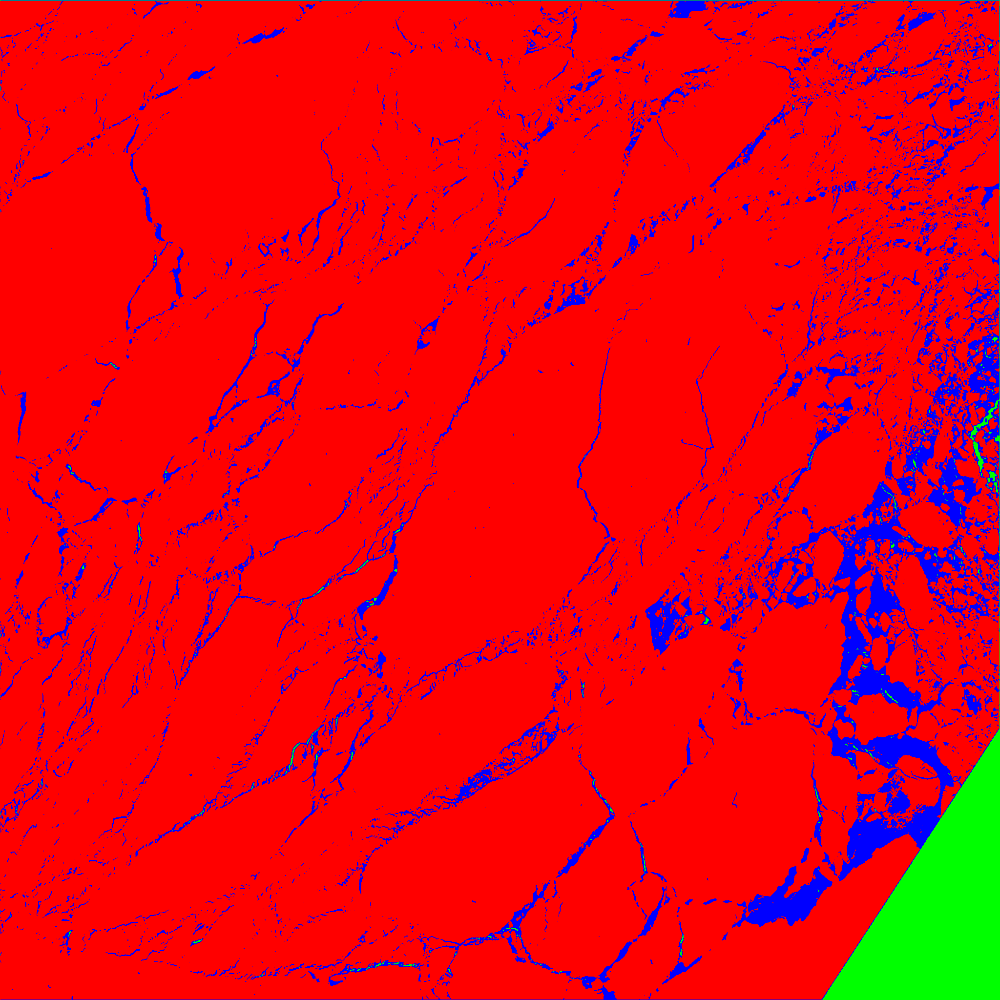 |
| _Our whole-scene prediction — original branch, scene 00_ | _Our whole-scene prediction — filtered branch, scene 00_ |

The paper's Fig 9 describes the production path: a full scene is tiled, each tile is classified, and the predictions are merged back into one per-scene sea-ice map. These are that merged output for scene 00 from both trained branches (66 scenes x 2 branches were produced). Red = thick ice, blue = thin ice, green = open water. The paper shows no whole-scene figure to match numerically, so this pairing is qualitative.

### 3.5 Headline metrics (paper Table IV)

_Table IV — U-Net-Man vs U-Net-Auto accuracy on original and filtered S2 imagery._

**Paper:**

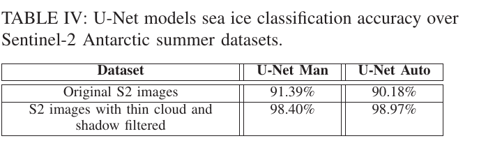

_table4_metrics_

**Ours — run0003 — authors' 66-scene dataset:**

| &nbsp; | &nbsp; |
|:---:|:---:|
| 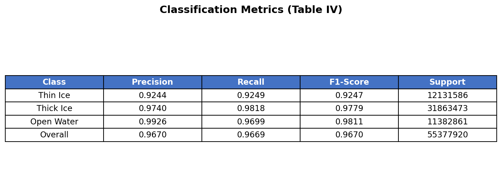 | 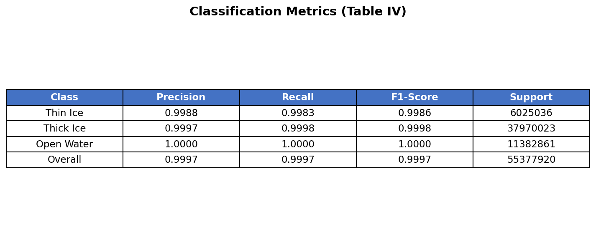 |
| _Our metrics — Original S2 imagery_ | _Our metrics — Thin cloud / shadow-filtered S2 imagery_ |

See §2 above for the per-class numeric comparison.

## 4. Conclusions

- **Original S2 imagery (U-Net-Auto):** 96.69% accuracy vs paper's 90.18% (+6.51 pt).
- **Thin cloud / shadow-filtered S2 imagery (U-Net-Auto):** 99.97% accuracy vs paper's 98.97% (+1.00 pt).
- **Filtering helps us less than it helped the paper:** our original→filtered swing is +3.28 pt against the paper's +8.79 pt (90.18% → 98.97%). The direction reproduces; the magnitude does not, because our unfiltered baseline already starts 6.51 pt above the paper's and so has far less room to gain. Both effects trace to the same cause — self-consistent auto-labels (§0.6).
- **Read every Δ above with that caveat.** Exceeding the paper here is a property of how the labels are made, not evidence of a better model.

See `comparison_report.html` for the styled long-form discussion of methodology, code review, and remaining differences.

---
_Generated by `compare_with_paper.py` from output_run0003_authors and A_Parallel_Workflow_for_Polar_Sea-Ice_Classification_Using_Auto-Labeling_of_Sentinel-2_Imagery.pdf._
